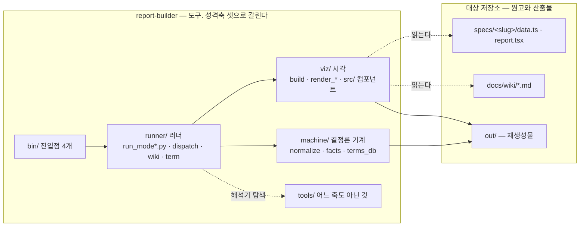
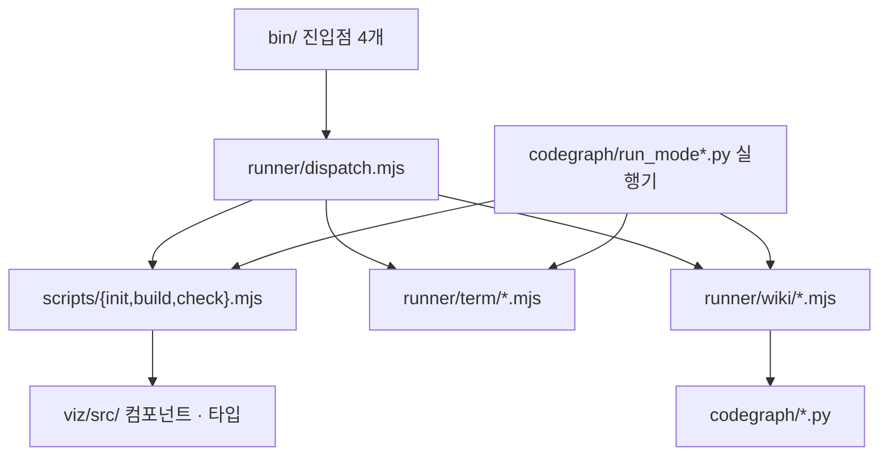
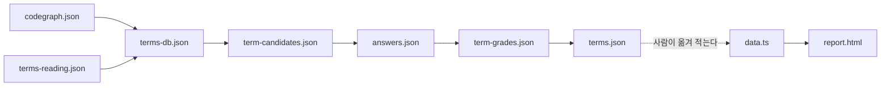
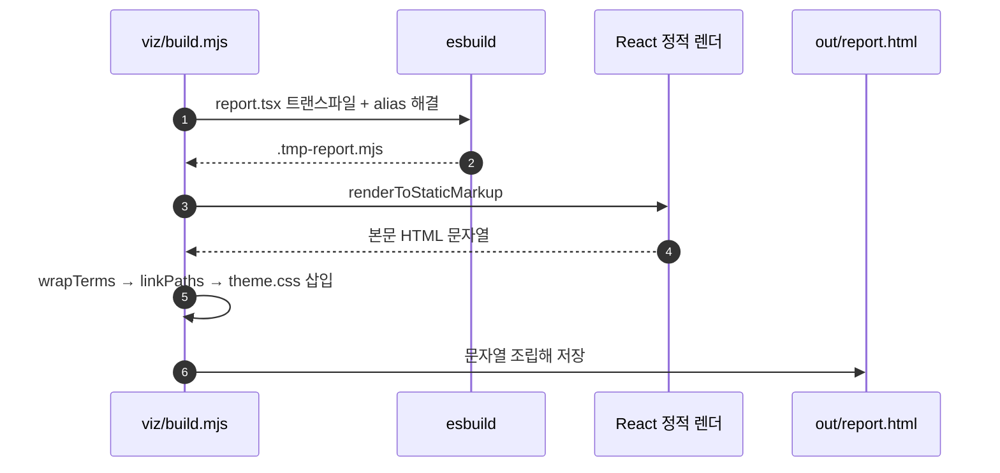

ARCHITECTURE — report-builder 의 구조

이 문서는 **코드가 서로를 어떻게 부르는가**만 적는다. 규약·함정·기각안은 `CLAUDE.md` 에, 설치 절차는 `README.md` 에 있다.

읽는 사람이 배경 지식을 갖고 있다고 가정하지 않는다. 처음 나오는 낱말은 그 자리에서 푼다.

표기 — 🔵 는 실제로 읽은 `파일:줄` 또는 실제로 돌린 명령의 출력, 💭 는 거기서 끌어낸 판단(사실이 아니다).
`파일:줄` 인용은 `machine/verify_citations.py` 로 기계 검사가 된다.

---

## 0. 한 문단 요약

이 저장소는 **렌더러**다. 자기 안에 보고서를 쌓지 않고, **다른 저장소**를 읽거나 다른 저장소에 산출물을 만든다.
갈래는 셋이고 각각 CLI 진입점 하나와 파이썬 실행기 하나를 갖는다. 갈래마다 큰 언어 모형(LLM)을 부르는 칸이
**정확히 하나**이며, 실측상 그 한 칸이 전체 시간의 99% 를 쓴다. 나머지는 전부 결정론적 기계 단계다.

---

## 1. 두 저장소에 걸쳐 있다는 것이 아키텍처의 전부다

가장 비직관적인 사실부터. **이 저장소에는 보고서도 위키도 없다.** 원고는 대상 저장소에 살고,
여기에는 그것을 굽는 도구만 있다.



**축은 언어가 아니라 성격이다** (2026-08-30 분리). `viz/` 에 파이썬 셋(`render_classes` ·
`render_modules` · `demermaid`)이 있고 `runner/` 에 `.mjs` 아홉이 있다. 가르는 질문은
"무엇으로 쓰였나" 가 아니라 **"계산하는가 · 그리는가 · 시키는가"** 다.

### 무엇이 어디에 사는가


| 사는 곳            | 무엇                                                                        | 왜 거기인가                                           |
| --------------- | ------------------------------------------------------------------------- | ------------------------------------------------ |
| report-builder  | `viz/src/components/` React 컴포넌트, `viz/src/theme.css`                             | 모든 보고서가 공유한다. 읽기 전용                              |
| report-builder  | `scripts/*.mjs` 빌드·검사, `codegraph/*.py` 정적 계층                             | 도구 본체                                            |
| 대상 저장소 (git 추적) | `specs/<slug>/data.ts` · `report.tsx`                                     | **원고**다. `.md` 와 같은 자격으로 그 저장소에 산다               |
| 대상 저장소 (git 추적) | `docs/wiki/*.md`                                                          | LLM 이 쓴 산문. 역시 원고다 (`runner/wiki/paths.mjs:22`) |
| 대상 저장소 (추적 안 함) | `out/codegraph-raw/` · `out/report.html` · `out/codegraph-raw/wiki-site/` | 결정론으로 재생성된다 (`runner/wiki/paths.mjs:18,23-25`)  |


### 이 갈림에서 나온 비직관적 결정 셋

**(가) 모듈 해결이 런타임과 타입 검사에서 서로 다른 길을 탄다.**
대상 저장소의 원고는 `import { Page } from "report-builder"` 라고 쓰는데, 그 저장소의 `node_modules` 에는
그런 패키지가 없다. 그래서 길을 둘 뚫었다.


|       | 담당                                                   | 가리키는 곳                                              |
| ----- | ---------------------------------------------------- | --------------------------------------------------- |
| 런타임   | `viz/build.mjs:54` 의 esbuild `alias`             | `viz/src/index.ts` · `viz/src/types.ts` · `viz/svg.mjs` |
| 타입 검사 | `viz/check.mjs:124` 가 임시 생성하는 tsconfig 의 `paths` | 같음. 단 svg 는 선언 파일 `viz/svg.d.mts`               |


한쪽만 고치면 다른 쪽이 조용히 깨진다.

**(나) 임시 파일은 `cwd` 가 아니라 이 저장소 뿌리(`ROOT`)에 쓴다.**
동적 `import()` 는 **파일이 놓인 자리**를 기준으로 `react/jsx-runtime` 을 찾는다. 대상 저장소에 두면
그 저장소에 React 가 없어 즉사한다 (`viz/build.mjs:36`). 타입 검사용 tsconfig 도 같은 이유로
`ROOT` 에 만들었다 지운다 (`viz/check.mjs:119`).

**(다) 위키 정적 사이트도 이 저장소 안에서 짓는다.**
`runner/wiki/build.mjs:98` 이 산문을 `.tmp/wiki/<저장소이름>/` 으로 복사한 뒤 거기서 VitePress 를 돌리고,
산출물만 절대경로 `outDir` 로 대상 저장소에 되돌려 보낸다 (`runner/wiki/build.mjs:109`).
같은 사정 — 대상 저장소에는 `node_modules` 가 없다.

---

## 2. 세 갈래(mode)와 그 안의 LLM 한 칸


| mode | 진입점           | 실행기                        | 하는 일                           |
| ---- | ------------- | -------------------------- | ------------------------------ |
| 1    | `report-wiki` | `runner/run_mode1.py`   | 코드베이스를 읽어 코드 지도와 위키를 만든다       |
| 1.5  | `report-term` | `runner/run_mode1_5.py` | 그 용어를 **사람이** 얼마나 아는지 객관식으로 잰다 |
| 2    | `report-spec` | `runner/run_mode2.py`   | 설계 문서를 한 장짜리 HTML 보고서로 압축한다    |


`bin/report` 는 옛 이름이며 `bin/report-spec` 을 자식 프로세스로 그대로 실행한다 (`bin/report:13`).

세 진입점은 명령표만 다르고 갈림길 함수는 하나를 공유한다 — `runner/dispatch.mjs:25` 의 `runDispatch` 가
명령 이름을 스크립트 경로로 바꿔(`runner/dispatch.mjs:13`) 자식 프로세스로 띄운다(`runner/dispatch.mjs:32`).

### 세 갈래의 단계 — 파랑은 기계, 주황은 LLM, 초록은 사람

flowchart LR  
  subgraph M1["Mode 1 — 코드베이스 위키"]  
    P1["prep"] --&gt; W1["warmup"] --&gt; SP1["survey-plan&lt;br/&gt;층·배치 계산"] --&gt; A1["survey&lt;br/&gt;층별 배치 N세션"]  
    A1 --&gt; S1["warmup-save"] --&gt; T1["terms"] --&gt; A1b["wiki&lt;br/&gt;목차 1 + 장 N세션"] --&gt; B1["build"] --&gt; C1["check"]  
  end  
  subgraph M15["Mode 1.5 — 용어 이해도"]  
    CO["collect"] --&gt; AU["author"] --&gt; H(["사람이 답안"]) --&gt; GR["grade"] --&gt; EM["emit"]  
  end  
  subgraph M2["Mode 2 — 설계 검토 보고서"]  
    I2["init"] --&gt; A2["agent"] --&gt; B2["build"] --&gt; C2["check"]  
  end  
  classDef machine fill:#e8f0fe,stroke:#4a6fa5,color:#123  
  classDef llm fill:#fde8c8,stroke:#c07a1e,color:#321,stroke-width:2px  
  classDef human fill:#e6f4ea,stroke:#3a7d44,color:#123,stroke-width:2px  
  class P1,W1,SP1,S1,T1,B1,C1,CO,GR,EM,I2,B2,C2 machine  
  class A1,A1b,AU,A2 llm  
  class H human

단계 목록은 상수로 못 박혀 있고 레지스트리나 플러그인 구조를 만들지 않는다
(세 실행기의 `STAGES`). LLM 칸은 Mode 1.5 와 Mode 2 가 하나씩이고, **Mode 1 만 둘**이다
(`run_mode1.py` 의 `AGENT_STAGES = {"survey", "wiki"}` — 2026-08-30 에 `agent` 한 칸이 갈렸다).

Mode 1 의 LLM 칸 둘(`survey` · `wiki`)은 **각각 여러 세션을 띄운다.** 그 세션을
`**claude-sonnet-5` 로 띄울 책임은 이 두 칸에 있고**, 실제 경로는 `run_mode1.py` 의
`--model` 기본값 하나다(`main` → `run_survey`/`run_wiki` → `run_layer` → `run_agent_with`
→ `claude_argv`). 사슬 중간에서 모형을 바꾸지 않는다.

**Mode 1 단계별로 무엇을 읽고 무엇을 쓰는가**


| 단계            | 기계/LLM        | 부르는 것                      | 읽는 것 → 쓰는 것                                                                                         |
| ------------- | ------------- | -------------------------- | --------------------------------------------------------------------------------------------------- |
| `prep`        | 기계            | `runner/wiki/prep.mjs`    | 대상 저장소 소스 → `out/codegraph-raw/codegraph.json` · `facts/*.md` · `ranking.json` · `modules.svg`      |
| `warmup`      | 기계            | `machine/warmup.py`      | 소스 + `warmup.json` + `codegraph.json` → (판정만. 파일을 쓰지 않는다)                                           |
| `survey-plan` | 기계            | `machine/survey_plan.py` | `codegraph.json` → `out/codegraph-raw/survey-plan.json` (층·배치. **모형을 부르지 않는다**)                     |
| `survey`      | **LLM 층별 N회** | `claude -p` 배치마다           | 소스 + `facts/*.md` + `survey-plan.json` → `_shards/*.json` → 합쳐서 `machine/terms-reading.json` |
| `warmup-save` | 기계            | `machine/warmup.py`      | 앞칸의 판정 → `out/codegraph-raw/warmup.json` (**전수조사가 성공했을 때만**)                                        |
| `terms`       | 기계            | `machine/terms_db.py`    | 읽기 레코드 + `codegraph.json` → `terms-db.json`                                                         |
| `wiki`        | **LLM 층별 N회** | `claude -p` 목차 1 + 장마다     | `terms-db.json` + `facts/*.md` → `wiki-plan.json` → `docs/wiki/*.md`                                |
| `build`       | 기계            | `runner/wiki/build.mjs`   | `docs/wiki/*.md` → VitePress 정적 사이트                                                                 |
| `check`       | 기계            | `runner/wiki/check.mjs`   | 산문 → 인용 판정 표 (표준 출력)                                                                                |


**Mode 2 단계별로**


| 단계      | 기계/LLM     | 부르는 것               | 도는 폴더                      |
| ------- | ---------- | ------------------- | -------------------------- |
| `init`  | 기계         | `viz/init.mjs`  | `specs/` 가 있는 **프로젝트 뿌리**  |
| `agent` | **LLM 1회** | `claude -p`         | 프로젝트 뿌리                    |
| `build` | 기계         | `viz/build.mjs` | **보고서 폴더** `specs/<slug>/` |
| `check` | 기계         | `viz/check.mjs` | 보고서 폴더                     |


단계마다 작업 폴더가 다르다는 것이 Mode 2 의 가장 조용한 함정이다. 틀려도 오류가 나지 않고 엉뚱한 곳에
파일이 생긴다. 그래서 갈림을 상수와 함수로 드러내 뒀다 (`runner/run_mode2.py:87`, `runner/run_mode2.py:105`).

### Mode 1.5 는 사람 앞에서 멈춘다

Mode 1 · 2 와 다른 점이 정확히 하나다. **사람 자리**다.
`answers.json` 이 없으면 실행기가 뒤 단계로 가지 않고 멈춘다 (`runner/run_mode1_5.py:150`).

💭 왜 사람을 모형으로 대신할 수 없나 — 이 도구가 재려는 값 자체가 *사람의* 이해도라서다. 모형에게
답을 시키면 재는 대상이 바뀐다. 이 논거는 `runner/run_mode1_5.py` 머리 주석에 적혀 있다.

한 용어당 문항은 3개로 고정이며 채점 구간도 상수다 (`runner/term/quiz.mjs:12`). CLI 는 사람에게 묻지 않는다 —
묻는 절차는 `term-benchmark` 스킬의 일이다.

---

## 3. 비대칭 — LLM 한 칸이 시간의 99% 를 쓴다

🔵 실측 (2026-08-30, 대상 QtVisionEdit, 백지 상태. 근거: `docs/superpowers/plans/2026-08-30-warmup-mode1-wiring.md:18`)


| Mode 1 단계   | 벽시계           | 토큰             |
| ----------- | -------------: | --------------: |
| `prep`      | 1.3초          | 0              |
| `**agent**` | **26분 53.1초** | **17,925,770** |
| `terms`     | 0.1초          | 0              |
| `build`     | 13.6초         | 0              |
| `check`     | 0.2초          | 0              |
| **합계**      | **27분 08.1초** | 17,925,770     |


시간의 **99.1%**, 토큰의 **100%** 가 `agent` 한 칸에 있다. 기계 네 단계를 다 합쳐 약 15.1초다.

⚠ **위 표는 옛 다섯 단계(`prep agent terms build check`)를 opus 한 세션으로 잰 값이다.**
2026-08-30 에 두 번 바뀌었다 — 먼저 warmup 두 관문이 붙어 일곱이 됐고, 이어서 `agent` 가
`survey` 와 `wiki` 로 갈려 **여덟**이 됐다(`machine/CLAUDE.md` 의 K1~K8).
배치·장 세션은 `**claude-sonnet-5**` 로 돈다.

🔵 **새 구조 실측 (2026-08-30, 같은 대상 QtVisionEdit, 같은 백지 상태). 근거:
`evals/runs/2026-08-30-mode1-qtvisionedit-cold-sonnet.json`.**


| 새 구조 단계                       | 벽시계                                        | 토큰             | 비고                                            |
| ----------------------------- | ------------------------------------------: | --------------: | --------------------------------------------- |
| `prep`                        | 57.3초                                      | 0              |                                               |
| `warmup`                      | 0.03초                                      | 0              | 판정만. `terms-reading.json` 이 없어 전량 조사로 판정      |
| `survey-plan`                 | 0.003초                                     | 0              | 층 6개 · 배치 17개로 나눔                             |
| `**survey`(층 0~5, 배치 17개 합)** | **≈17분 06초**(1026.3초, 총 벽시계에서 나머지 단계를 뺀 값) | **14,842,174** | 층 안 병렬(동시 최대 8) · 층 사이 순차. 턴 221 · 비용 $9.2236 |
| `warmup-save`                 | 0.001초                                     | 0              |                                               |
| `terms`                       | 0.065초                                     | 0              | **실패 — 종료 코드 1**(아래)                          |
| `wiki`·`build`·`check`        | —                                          | —              | **돌지 않았다** — `terms` 가 막아서 뒤 단계로 못 갔다         |
| **합계(멈춘 지점까지)**               | **18분 03.7초**                              | **14,842,174** | 비용 $9.2236 · 턴 221                            |


⚠ **이 실행은 끝까지 못 갔다.** `terms_db.py` 가 용어 166개 중 **50개를 실패**로 판정해
(`uses.to` 가 가리키는 이름이 용어 사전에 없음 — 예: `cv::warpPerspective` 같은 OpenCV 심볼,
`SJH::Server::SessionStore` 같은 프로젝트 내부 심볼도 섞여 있다) 종료 코드 1을 냈고,
`run_mode1.py` 는 "뒤 단계는 이 산출물에 기대므로 여기서 멈춘다"며 `wiki`·`build`·`check` 를
건너뛰었다. 그래서 `**survey`(전수조사) 한 칸의 실측은 확보했지만 `wiki`(산문) 이후의
새 구조 값은 여전히 없다.**

**옛 구조(opus, 5단계, 합쳐진 `agent` 한 칸) 대 새 구조(sonnet, `survey` 만) 비교** — 대상·백지
상태는 같지만 **모형도 다르고 재는 범위도 다르다**(새 쪽은 `wiki` 가 빠졌다). 그래서 아래는
참고용이지 "몇 배 빨라졌다/느려졌다" 로 읽으면 안 된다.


|     | 옛(opus, `agent` 전체) | 새(sonnet, `survey` 만) |
| --- | -------------------: | ---------------------: |
| 토큰  | 17,925,770          | 14,842,174            |
| 비용  | $15.50              | $9.22                 |
| 벽시계 | 26분 53초             | ≈17분 06초              |


💭 `survey` 만으로 이미 옛 `agent`(survey+wiki 합) 토큰의 83% 를 썼다는 것은, `wiki` 단계가
붙으면 새 구조 총합이 옛 기준선을 넘어설 수도 있다는 뜻이다 — 아직 `wiki` 를 재지 못했으니
단정할 수 없다.

**남은 일** — `terms` 실패의 원인(외부 라이브러리 심볼을 `uses.to` 로 채운 레코드를 어떻게
다룰지)을 고치거나 우회한 뒤 다시 돌려야 `wiki`·`build`·`check` 를 포함한 새 구조 전체 실측이
나온다. 그전까지 **"층 병렬 덕분" 이라고 귀속할 수 없다** — 기준선과 모형이 다르고, 이번 실행은
완주도 못 했다.

🔵 Mode 2 도 같은 모양이다. 같은 실행기로 잰 연습 실행(haiku)에서 전체 149.2초 중 `agent` 가 147.98초로
**99.2%**, 기계 세 단계 합은 약 1.2초였다. (이 측정 기록은 실행 산출물이라 저장소에 커밋돼 있지 않다.
`runner/run_mode2.py` 의 `--json` 으로 다시 낼 수 있다.)

💭 여기서 나오는 설계 결론 하나 — **기계 단계를 최적화할 여지가 없다.** 성능을 건드릴 자리는
`agent` 의 *입력 범위* 뿐이고, 그것이 `machine/warmup.py` 가 존재하는 이유다(파일 해시로 다시 읽을
파일만 골라낸다). 🔵 2026-08-30 에 배선됐다(`1e5d766`) — `run_mode1.py` 의 `STAGES` 가 일곱이 되어
`warmup` 과 `warmup-save` 가 `agent` 앞뒤를 감싼다. 🔵 QtVisionEdit 에서 아무것도 안 바뀐 실행은
`agent` 가 **건너뜀 · 토큰 0 · $0** 으로 그려진다. **다만 국소 변경을 준 증분 실행의 절감폭은 아직
재지 않았다**(계획서 Task 9 미실행) — 위 냉시동 표가 여전히 유일한 기준선이다.

---

## 4. 모듈 간 의존 — 한 방향으로만 흐른다

### 계층



### 실제로 확인한 방법과 결과

🔵 저장소 안 상대 import 를 전수로 뽑아 확인했다.

```bash
grep -rnE '^(import|from) ' codegraph/*.py            # 표준 라이브러리를 걸러낸 뒤
grep -rnE '^import .* from "\.' scripts/ bin/ viz/src/    # 상대 경로 import 만
```

파이썬 쪽 저장소 내부 import 는 시험 파일을 빼면 여섯 줄뿐이다.


| 부르는 쪽                       | 불리는 쪽              | 줄                              |
| --------------------------- | ------------------ | ------------------------------ |
| `machine/normalize.py`    | `clang_doc`        | `machine/normalize.py:20`    |
| `machine/reverse_refs.py` | `clangd_refs`      | `machine/reverse_refs.py:17` |
| `machine/terms_db.py`     | `verify_citations` | `machine/terms_db.py:31`     |
| `machine/warmup.py`       | `declmap`          | `machine/warmup.py:45`       |
| `runner/run_mode1_5.py`  | `run_mode1`        | `runner/run_mode1_5.py:81`  |
| `runner/run_mode2.py`    | `run_mode1`        | `runner/run_mode2.py:68`    |


Node·TypeScript 쪽도 같은 모양이다 — `bin/*` → `runner/dispatch.mjs`, `viz/build.mjs` →
`wrap-terms.mjs`·`link-paths.mjs` (`viz/build.mjs:13-14`), `runner/wiki/*` → `paths.mjs`·`python.mjs`,
`viz/src/index.ts:5-7` → `viz/src/components/index.ts` → 개별 컴포넌트, `viz/src/components/tables.tsx:6` → `badges.js`,
`viz/src/runtime/term-graph.ts:16` → `graph-math.js`.

**🔵 import 층위의 순환은 0건이다.** 위 표의 여섯 쌍 어디에도 되돌아오는 변이 없고, Node 쪽도 마찬가지다.
같은 결론을 이 저장소의 자체 도구로도 얻었다 — `render_modules.py` 가 `순환 0개, 순환 참여 간선 0개` 를 냈다(아래 §8).

**다만 언어 층에는 왕복이 있다.** Python 실행기가 Node 스크립트를 자식 프로세스로 부르고
(`runner/run_mode1.py:247`), 그 Node 스크립트가 다시 Python 도구를 부른다
(`runner/wiki/prep.mjs:131`, `:135`, `:137`). Python → Node → Python 이다.

💭 이것을 순환으로 세지 않는 이유 — 프로세스 경계라 한쪽을 고쳐도 다른 쪽이 다시 컴파일되지 않고,
부르는 방향도 늘 실행기 → 스크립트 → 도구 한 갈래다. 되돌아오는 호출은 없다.

### 한 곳에만 있는 지식


| 지식                                  | 사는 곳                                         |
| ----------------------------------- | -------------------------------------------- |
| 접기 규칙과 kind 대응표 (언어 도구의 낱말 → 공통 낱말) | `machine/normalize.py` 만                   |
| 위키 경로 규약                            | `runner/wiki/paths.mjs:17` 의 `wikiPaths` 만  |
| 파이썬 해석기 찾기                          | `tools/python.mjs:43` 의 `pythonPath` 만     |
| 측정 코드 (토큰 세기·합계·표 그리기)              | `runner/run_mode1.py` 만. 1.5 와 2 는 가져다 쓴다 |


---

## 5. 데이터 흐름 — 어느 도구가 만들고 어느 도구가 읽는가




| 파일                                              | 만드는 것                                                  | 읽는 것                                                                     |
| ----------------------------------------------- | ------------------------------------------------------ | ------------------------------------------------------------------------ |
| `out/codegraph-raw/codegraph.json`              | `machine/normalize.py` (`runner/wiki/prep.mjs:131`) | `facts.py` · `render_modules.py` · `terms_db.py` · `verify_citations.py` |
| `out/codegraph-raw/facts/*.md` · `ranking.json` | `machine/facts.py` (`runner/wiki/prep.mjs:135`)     | LLM 이 프롬프트로 받는다                                                          |
| `machine/terms-reading.json`             | LLM (`agent` 단계)                                       | `machine/terms_db.py`                                                  |
| `out/codegraph-raw/terms-db.json`               | `machine/terms_db.py`                                | `runner/term/collect.mjs`                                               |
| `term-candidates.json`                          | `runner/term/collect.mjs:26` · `:45`                  | 사람 / 출제 모형                                                               |
| `answers.json`                                  | **사람**                                                 | `runner/term/quiz.mjs:38`                                               |
| `term-grades.json`                              | `runner/term/quiz.mjs`                                | `runner/term/emit.mjs`                                                  |
| `terms.json` · `term-study-note.md`             | `runner/term/emit.mjs:18` · `:33`                     | 사람. Mode 2 의 `data.ts` 로 **손으로** 옮긴다                                     |
| `specs/<slug>/data.ts`                          | `viz/init.mjs` 가 뼈대, LLM 이 본문                      | `viz/build.mjs` · `viz/check.mjs`                                |
| `specs/<slug>/out/report.html`                  | `viz/build.mjs:152`                                | 사람                                                                       |


`**terms.json` → `data.ts` 사이만 자동이 아니다.** 기계로 병합하지 않는 것이 의도다 —
`data.ts` 는 사람이 읽는 원고이고, 옮기면서 뜻을 다듬는 것이 그 단계의 일이라고 못 박아 뒀다
(`runner/run_mode2.py` 머리 주석 · `viz/init.mjs:107-110`).

### 보고서 굽기 — 문자열 조립까지



5번의 후처리 둘 — `viz/build.mjs:80` 의 `wrapTerms` 가 본문 용어를 설명 카드 마크업으로 감싸고,
`viz/build.mjs:99` 의 `linkPaths` 가 경로 꼴 낱말을 실제 로컬 파일 링크로 바꾼다.
**React 는 빌드 시점 Node 에만 있고, 산출물은 순수 HTML + CSS 다.**

---

## 6. 불변식과 그것을 지키는 검사


| 불변식                  | 뜻                                                      | 어느 명령이 검사하나                                                                                              |
| -------------------- | ------------------------------------------------------ | -------------------------------------------------------------------------------------------------------- |
| `<script>` **1개 이하** | 결과물은 정적 HTML 이다. 예산 1칸은 용어 그래프 런타임이 쓴다                 | `report-spec build` 가 굽는 즉시 (`viz/build.mjs:156`) **와** `report-spec check` (`viz/check.mjs:17`) |
| 타입이 맞는다              | 원고의 `data.ts`·`report.tsx` 가 `viz/src/types.ts` 와 어긋나지 않는다 | `report-spec check` 가 임시 tsconfig 로 `tsc --noEmit` (`viz/check.mjs:136`)                             |
| 링크 무결성               | `data.ts` 의 결정 id 와 `report.tsx` 의 절이 1:1              | `report-spec check` (`viz/check.mjs:29`)                                                             |
| 용어집 대조               | 본문의 식별자 꼴 낱말에 정의가 있나                                   | `report-spec check` — **경고이지 실패가 아니다** (`viz/check.mjs:50`)                                          |
| `builderVersion` 일치  | 원고가 어느 도구 버전으로 만들어졌나                                   | `report-spec check` — 경고까지 (`viz/check.mjs:76`)                                                      |
| 인용 L1/L2/L3          | 문서의 `파일:줄` 이 진짜인가                                      | `report-wiki check` → `machine/verify_citations.py` (`runner/wiki/check.mjs:57`)                      |


### 인용 3값 판정이 이 파이프라인의 차별점이다


| 층   | 묻는 것               | 어떻게                                                         |
| --- | ------------------ | ----------------------------------------------------------- |
| L1  | 그 파일이 있나           | 파일 존재 확인 (`machine/verify_citations.py:142`)              |
| L2  | 그 줄이 있나            | 줄 수 비교 (`machine/verify_citations.py:150`)                |
| L3  | **그 위치에 그 심볼이 있나** | `codegraph.json` 과 대조 (`machine/verify_citations.py:156`) |


판정은 통과 / 실패 / **근거 없음** 3값이다. "근거 없음" 은 L1·L2 는 통과했으나 코드 지도에 그 위치의
선언이 없는 경우이고, 종료 코드는 L1·L2 실패가 있을 때만 1 이다 (`machine/verify_citations.py:22`).

💭 왜 3값인가 — 함수 본문 줄처럼 코드 지도가 원래 담지 않는 자리가 있다. 그것을 통과로 세면 검사가
무의미해지고 실패로 세면 정상 인용이 전부 실패한다.

### 시험


| 명령                                      | 무엇                                                      | 🔵 이번 실측        |
| --------------------------------------- | ------------------------------------------------------- | --------------- |
| `npm test`                              | Node 쪽 순수 함수와 컴포넌트                                      | 141 통과 · 0 실패   |
| `.venv/bin/python -m pytest codegraph/` | 파이썬 쪽                                                   | 201 통과 · 19 건너뜀 |
| `npm run typecheck`                     | 이 저장소 `viz/src/` 의 `tsc --noEmit`                           | —               |
| `npm run doctor`                        | 이 컴퓨터에 무엇이 있나. 필수가 없으면 exit 1 (`tools/doctor.mjs:51`) | —               |


**건너뛴 19개는 골든 시험이다.** 합성 데이터만으로 검증하지 않으려고 실제 저장소의 산출물을 읽는데,
그 저장소 경로가 환경변수로 들어온다(`GRAPHICS_REPO` · `CSHARP_REPO` · `CPP_REPO`). 변수가 없으면
건너뛴다 — 실패가 아니다. 변수가 비었을 때 빈 문자열이 되면 상대경로로 풀려 **이 저장소의 산출물을
골든으로 착각한다.** 그래서 존재할 수 없는 경로를 준다 (`machine/test_normalize.py:28`).

**테스트가 `viz/src/` 를 직접 import 하지 않는다.** `node --test` 는 JSX 를 못 읽으므로 `viz/lib.mjs` 가
`.tmp/lib.mjs` 로 먼저 굽고 테스트가 그것을 읽는다 (`test/components.test.mjs:5`).

---

## 7. 확장 지점과 막힌 지점

### 새 정적 수집기를 더하려면

정적 수집기란 소스를 읽어 "무엇이 무엇을 쓰는가" 를 뽑아 주는 바깥 도구다. 지금은 **둘 고정**이다.


| 언어  | 도구                                  | 무엇을 낸다            |
| --- | ----------------------------------- | ----------------- |
| C++ | `clang-uml` + `clang-doc`           | 타입 사이의 관계 + 심볼 전량 |
| C#  | `machine/roslyn-dump` (.NET 프로그램) | 타입·멤버 덤프          |


고를 곳은 한 곳뿐이다 — `runner/wiki/paths.mjs:39` 의 `collectorFor` 가 저장소 최상위 파일 목록만 보고
고른다 (`.csproj`/`.slnx`/`.sln` 이면 C#, `CMakeLists.txt` 면 C++). 셋째를 더하려면 손댈 자리는 셋이다.

1. `runner/wiki/paths.mjs:39` — 고르는 규칙에 한 줄
2. `runner/wiki/prep.mjs:24` 의 `prepPlan` — 어떤 단계를 어떤 순서로 돌릴지
3. `machine/normalize.py` — 그 도구의 낱말을 공통 `codegraph.json` 낱말로 옮기는 대응표

**왜 이것을 쉽게 만들지 않았나.** 플러그인 구조·파서 레지스트리·추상 인터페이스를 만들면 그 자체가
이 도구가 잡으려는 실패(거울 함정)가 된다. 구현자 1, 소비자 1 이면 인터페이스를 만들지 않는다는
규율을 코드 주석에 적어 뒀다 (`runner/wiki/paths.mjs:35`, `machine/normalize.py:14`).

### 일부러 막아 둔 곳


| 막힌 것                             | 왜                                                                           |
| -------------------------------- | --------------------------------------------------------------------------- |
| 산출물에 `<script>` 를 하나 더 넣기        | 예산이 다 찼다. 새 런타임 코드는 기존 번들 안에 합쳐야 한다 (`viz/build.mjs:117`)               |
| 도구가 수용/보류/번복을 판정하기               | 판정은 사람 몫이다. `VerdictFooter` 는 비워서 낸다 (`viz/src/components/VerdictFooter.tsx:9`) |
| CLI 가 사람에게 되묻기                   | 묻는 절차는 스킬의 일이다 (`runner/term/quiz.mjs:6`)                                  |
| `terms.json` 을 `data.ts` 로 자동 병합 | 옮기면서 뜻을 다듬는 것이 그 단계의 일 (`viz/init.mjs:107`)                             |
| 컴포넌트의 props 를 없애거나 뜻을 바꾸기        | 추가만 한다. API 가 바뀌면 태그를 올린다                                                   |
| 코드에 절대경로를 박기                     | 파이썬은 `tools/python.mjs:43`, 바깥 명령은 PATH 로 찾는다                             |


### 컴포넌트 층

`viz/src/index.ts:5-7` 이 바깥문이다. 실제 구현은 여섯 파일로 갈려 있고 `viz/src/components/index.ts:4-9` 가 모은다 —
`badges` · `tables` · `blocks` · `BeforeAfter` · `VerdictFooter` · `terms`. 상태를 갖는 것은
`viz/src/runtime/term-graph.ts` 하나뿐이며 React 훅은 쓰지 않는다.

다이어그램 확대는 자바스크립트 0줄로 되어 있다 — 체크박스 하나와 형제 결합자다
(`viz/src/theme.css:77-79`). 그 복구의 급소는 `--svg-w` 로, `viz/svg.mjs:18` 이 원본 크기를 px 로 환산해
돌려주고 `viz/src/components/BeforeAfter.tsx:14` 가 인라인 style 로 주입한다. 연결고리 하나만 끊겨도
"실제 크기" 모드가 조용히 죽는다.

---

## 8. 이 그림을 다시 그리는 법

위 다이어그램들은 손으로 그렸다. **기계가 그린 모듈 관계도**가 따로 있고, 명령 하나로 다시 낸다.

```bash
.venv/bin/python viz/render_modules.py out/codegraph-raw/codegraph.json -o /tmp/modules
# → /tmp/modules.svg · .png · .dot
```

🔵 이번에 실제로 돌린 출력 — `언어 unknown — 모듈 7 / 의존 1 / 외부 0` · `순환 0개, 순환 참여 간선 0개`.
모듈 7개는 `codegraph` · `scripts` · `scripts/term` · `scripts/wiki` · `src` · `viz/src/components` · `viz/src/runtime` 이다.

⚠ **이 코드 지도는 이 저장소 자신을 완전히 담고 있지 않다.** 🔵 노드 173 · 간선 105 인데
`language` 가 `unknown` 이고 모듈 간 의존은 1건만 잡혔다 — 위 §4 에서 손으로 센 상대 import 보다 적다.
정적 수집기가 C++ 과 C# 둘뿐이라 이 저장소(Python + TypeScript)는 본래 대상이 아니다.
**모듈 사이 의존을 알고 싶으면 §4 의 표를 보라.** 기계 그림은 참고다.