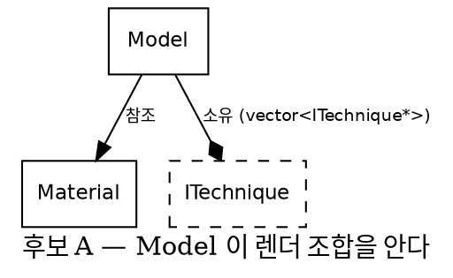
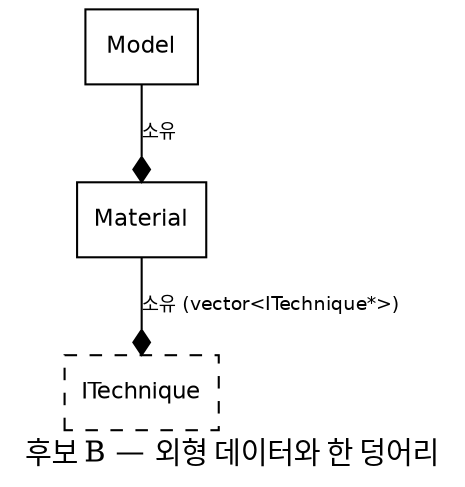

# 설계 검토 보고서 시스템(report-builder) Implementation Plan

> **For agentic workers:** REQUIRED SUB-SKILL: Use superpowers:subagent-driven-development (recommended) or superpowers:executing-plans to implement this plan task-by-task. Steps use checkbox (`- [ ]`) syntax for tracking.

**Goal:** 설계 검토 보고서를 `data.ts` + `report.tsx` 두 소스에서 클라이언트 런타임 없는 단일 HTML로 빌드하는 `report` CLI를 만들고, 그 전에 현재 고장난 다이어그램 가독성을 복구한다.

**Architecture:** 빌드 시점 Node에서 esbuild가 TSX를 트랜스파일하고 React `renderToStaticMarkup`이 HTML 문자열만 생성한다. React는 산출물에 들어가지 않는다. CSS 6,599자와 Graphviz SVG는 Node 문자열 조립으로 `<style>`·본문에 인라인된다. 번들러의 CSS 파이프라인도, 클라이언트 상태도 쓰지 않는다.

**Tech Stack:** Node v25.8.0 · TypeScript 7.0.2 (`tsc --noEmit`만) · esbuild 0.28.2 · React 19.2.8 (`renderToStaticMarkup` 전용) · Graphviz 15.1.1 (`-Tsvg_inline`) · `node --test` (내장 러너, 추가 의존성 없음)

**사양 원본:** `docs/handoffs/ReportSystem_HandOff.md`. 이 계획과 인계 문서가 어긋나면 인계 문서가 정본이다.

---

## 이 계획의 범위

| Phase | 인계 문서 대응 | 성격 | 산출물 |
|---|---|---|---|
| 0 | (전제) | **사용자 작업** | 개발 환경 |
| 1 | B1 | 코드 + **사용자 판정** | 읽히는 다이어그램 |
| 2 | B2 | 자료 준비 + **사용자 판정** | `.dot` 2장 + 판정 시간 비교 |
| 3 | A1 | **문서** (코드 아님) | 소급 검증 보고서 |
| 4 | B3 | 코드 | `report` CLI + 컴포넌트 |
| 5 | B4 | 코드 | `check.mjs` |
| 6 | B5 | 코드 + **사용자 판정** | 기존 2건 재생성·대조 |
| 7 | A2~A4 | **이 계획 범위 밖** | A1 통과 후 별도 계획 |

**Phase 7을 이 계획에 넣지 않은 이유:** 인계 문서는 "Task A1이 끝나기 전에 D축 관련 코드를 쓰지 말 것"이라고 명시한다. 또 `data.ts`의 D축 필드 포함 여부가 A1 결과에 달려 있다(§B-7). A1 결과를 모르는 상태에서 A2의 상세 태스크를 쓰면 폐기될 코드의 계획을 쓰는 것이다. **Phase 3 완료 후 별도 계획을 작성한다.**

**Phase 3(A1)은 Phase 4~6과 독립적이다.** 인계 문서 권장 순서는 A1을 B3보다 앞에 두지만 "B3~B5는 A1 결과와 무관하게 진행 가능"이라고 명시한다. A1은 문서 작업이고 Phase 4~6은 코드 작업이므로 순서를 바꿔도 되고 병행해도 된다. **다만 Phase 1과 2는 반드시 먼저 끝낸다.**

---

## File Structure

Phase 4에서 만들어질 파일과 각각의 책임이다.

```
~/report-builder/
  package.json                 devDependencies + npm scripts
  tsconfig.json                noEmit 타입 검사 전용 설정
  .gitignore                   node_modules, out/, .tmp/
  bin/report                   CLI 진입점 — init/build/check 디스패치만
  src/
    types.ts                   props 타입 정의. 런타임 코드 없음
    theme.css                  정본 HTML에서 추출한 CSS + B1 패치
    page.tsx                   페이지 셸 — header/section/footer 골격
    components/
      badges.tsx               ConfBadge, StatusTag        (인라인 span 계열)
      tables.tsx               DecisionTable, OptionTable, LockTable  (.card .table-wrap 계열)
      blocks.tsx               NewStructNote, Reversal, Correction, TriageBlock  (박스 계열)
      BeforeAfter.tsx          다이어그램 패널 — SVG 삽입 로직 보유
      VerdictFooter.tsx        사용자 기입란
      index.ts                 재수출
  scripts/
    svg.mjs                    Graphviz SVG 정규화 — 순수 함수, 테스트 대상
    build.mjs                  esbuild → renderToStaticMarkup → 문자열 조립
    check.mjs                  검사 규칙
    lib.mjs                    src/ → .tmp/lib.mjs 빌드 (테스트가 import)
    patch-legacy.mjs           Phase 1 전용 — 기존 HTML 2건에 theme.css 이식
  test/
    svg.test.mjs               svg.mjs 단위 테스트
    components.test.mjs        컴포넌트 렌더 결과 테스트
    check.test.mjs             검사 규칙 테스트
  docs/
    superpowers/plans/         이 계획
    handoffs/                  인계 문서
```

**분해 축(design-decision-discipline §2.7):** 컴포넌트 파일은 **CSS 블록 친화도**로 묶었다. `theme.css`의 주석 구획(배지 / 표 / 다이어그램 / 푸터)과 1:1로 대응하므로 CSS를 고칠 때 함께 고칠 파일이 한 곳에 모인다. 컴포넌트 11개를 11개 파일로 쪼개지 않은 것은 각각이 3~15줄이기 때문이다(YAGNI).

---

## 착수 전 확인된 사실 (2026-08-26 실측)

계획의 명령·수치는 아래 실측값에 근거한다. 추측값 아님.

| 항목 | 값 | 확인 방법 |
|---|---|---|
| Graphviz | 15.1.1 | `dot -V` |
| `dot -Tsvg_inline` | 동작함. `<?xml?>`·DOCTYPE 없이 출력 | 실행 확인 |
| Node | v25.8.0 | `node -v` |
| `node --test` | 사용 가능 | 실행 확인 |
| Node 타입 스트리핑 | `strip` — **단 JSX는 스트리핑 대상이 아님** | `process.features.typescript` |
| typescript | **미설치**. 최신 7.0.2 | `npm view typescript version` |
| esbuild | **미설치**. 최신 0.28.2 | `npm view esbuild version` |
| react / react-dom | **미설치**. 최신 19.2.8 | `npm view react version` |
| 정본 HTML CSS | 두 파일 **바이트 동일**, 6,599자 | `awk` 추출 후 `diff` |
| 정본 HTML `<script>` | **0개** | `grep -c '<script'` |
| before SVG 폭 | 1961pt = 2615px, 노드 글꼴 10pt | `grep viewBox`, `grep font-size` |

**JSX가 Node 타입 스트리핑 대상이 아니라는 점이 테스트 구조를 결정한다.** `node --test`가 `.tsx`를 직접 import할 수 없으므로, 테스트는 esbuild가 미리 빌드한 `.tmp/lib.mjs`를 import한다(`scripts/lib.mjs`).

---

# Phase 0 — 개발 환경 구축 (사용자 작업)

**이 Phase는 전부 사용자가 직접 실행한다.** 인계 문서 §B-3은 "node_modules 사전 설치 완료 전제"라고 적었으나 **실제로는 설치돼 있지 않다.** 이 Phase가 그 전제를 충족시킨다.

### Task 0.1: npm 초기화와 의존성 설치

**Files:**
- Create: `package.json`

- [ ] **Step 1: 패키지 초기화**

```bash
cd ~/report-builder
npm init -y
npm pkg set name=report-builder version=0.1.0 type=module private=true
npm pkg set description="설계 검토 보고서 단일 HTML 빌더"
```

`type=module`이 필수다. `.mjs`와 `.ts`가 ESM으로 동작해야 `renderToStaticMarkup`을 `import`할 수 있다.

- [ ] **Step 2: 의존성 설치**

```bash
npm install --save-dev \
  typescript@7.0.2 \
  esbuild@0.28.2 \
  react@19.2.8 \
  react-dom@19.2.8 \
  @types/node@26.3.0 \
  @types/react@19.2.18 \
  @types/react-dom@19.2.5
```

**react가 dependencies가 아니라 devDependencies인 이유:** 이 패키지는 라이브러리로 배포되지 않는다(`private: true`). React는 빌드 시점 Node에서만 실행되고 산출물에 들어가지 않으므로 런타임 의존성이 아니다.

- [ ] **Step 3: 설치 검증**

```bash
npx tsc -v
npx esbuild --version
node -e "import('react-dom/server').then(m => console.log('renderToStaticMarkup:', typeof m.renderToStaticMarkup))"
```

Expected:
```
Version 7.0.2
0.28.2
renderToStaticMarkup: function
```

`npx tsc -v`가 `Version 2.0.4`를 출력하거나 다운로드를 시도하면 **로컬 설치가 안 된 것이다.** `tsc@2.0.4`는 2016년의 무관한 패키지이며 npm이 이름만 보고 받아오는 함정이다.

- [ ] **Step 4: npm scripts 등록**

```bash
npm pkg set scripts.build="node scripts/build.mjs"
npm pkg set scripts.check="node scripts/check.mjs"
npm pkg set scripts.typecheck="tsc --noEmit"
npm pkg set scripts.pretest="node scripts/lib.mjs"
npm pkg set scripts.test="node --test"
```

### Task 0.2: tsconfig.json

**Files:**
- Create: `tsconfig.json`

- [ ] **Step 1: 설정 파일 작성**

```json
{
  "compilerOptions": {
    "target": "ES2023",
    "module": "ESNext",
    "moduleResolution": "bundler",
    "jsx": "react-jsx",
    "strict": true,
    "noEmit": true,
    "skipLibCheck": true,
    "allowImportingTsExtensions": true,
    "verbatimModuleSyntax": true,
    "types": ["node"]
  },
  "include": ["src/**/*.ts", "src/**/*.tsx"]
}
```

`"noEmit": true`가 핵심이다. 인계 문서 §B-2가 정한 대로 tsc는 **타입 검사만** 하고 트랜스파일은 esbuild가 한다. `include`에 `scripts/`와 `test/`가 없는 것은 그것들이 `.mjs`(순수 JavaScript)이기 때문이다.

- [ ] **Step 2: tsconfig 가 유효한지 확인**

`src/`가 비어 있는 동안 `npx tsc --noEmit`은 **에러로 끝나는 것이 정상이다.**

```
error TS18003: No inputs were found in config file ...
```

tsconfig 의 결함이 아니라 검사 대상이 없다는 뜻이다. 설정 자체를 확인하려면 임시 탐침을 넣었다 뺀다.

```bash
mkdir -p src && cat > src/__probe.tsx <<'PROBE'
import type { ReactNode } from "react";
const TIER = { green: "🔵", amber: "🟡", red: "💭" } as const;
export function Probe({ tier, children }: { tier: keyof typeof TIER; children: ReactNode }) {
  return <span className={`conf-badge conf-${tier}`}>{`${TIER[tier]} ${children}`}</span>;
}
PROBE
npx tsc --noEmit; echo "종료코드: $?"
rm -f src/__probe.tsx
```

Expected: `종료코드: 0` — JSX·strict·react 타입·verbatimModuleSyntax 가 모두 해결된다는 뜻이다.
(2026-08-26 typescript 7.0.2 로 실측 확인함.)

`src/types.ts`(Task 4.1)가 생긴 뒤부터는 `npx tsc --noEmit`이 그냥 통과한다.

### Task 0.3: PATH 등록

인계 문서 §B-2는 "`bin`을 PATH에 추가"를 확정 결정으로 정했다.

- [ ] **Step 1: zsh 설정에 추가**

```bash
echo 'export PATH="$HOME/report-builder/bin:$PATH"' >> ~/.zshrc
source ~/.zshrc
```

- [ ] **Step 2: 확인**

```bash
echo $PATH | tr ':' '\n' | grep report-builder
```

Expected: `$HOME/report-builder/bin`

`bin/report`는 Phase 4에서 만든다. 지금은 경로만 등록한다.

### Task 0.4: .gitignore와 최초 커밋

이 저장소는 **커밋이 0개**다. 인계 문서 §6은 원본 저장소 `.gitignore`에 `*.html`이 있는지 확인하라고 했고, 확인 결과 **없었다**(`html/`, `doxygen/html/` 디렉토리 패턴만 존재). 따라서 보고서 HTML 제외 규칙을 여기서 새로 만든다.

**Files:**
- Create: `.gitignore`

- [ ] **Step 1: .gitignore 작성**

```
node_modules/
.tmp/
.tmp-report.mjs

# 빌드 산출물 — 소스에서 재생성한다 (인계 문서 §B-3)
out/
**/specs/*/out/
```

- [ ] **Step 2: 최초 커밋**

```bash
cd ~/report-builder
git add -A
git commit -m "chore : 저장소 초기화와 개발 환경 구축"
```

커밋 메시지는 `personal-commit-messages` 스킬 형식(소문자 `[tag] : subject` 한 줄, 한국어, 본문 없음)을 따른다.

- [ ] **Step 3: 확인**

```bash
git log --oneline
git status --short
```

Expected: 커밋 1개, `node_modules/`가 status에 안 보임.

---

# Phase 1 — B1 다이어그램 가독성 복구

인계 문서 §B-1의 결함이다. **핵심 기능 복구이므로 1순위.**

## ⚠ 이 Phase에는 사용자 결정이 하나 있다

인계 문서 §B-7은 pan/zoom UX 형태(인라인 확대 / 모달 / 전체화면)를 **미결정**으로 남겼다. B1은 그 결정을 대신하지 않고, 결정 없이도 읽히게 만드는 최소 복구만 한다.

| | 방식 | 장점 | 단점 | `<script>` |
|---|---|---|---|---|
| A | 2열 → 1열 세로 스택 고정 | CSS 3줄 | 폭이 1048px로 늘어도 축소율 40% → 글자 5.3px. **여전히 안 읽힘** | 0 |
| **B (권장)** | **체크박스 토글 — 기본 2열 병치, 켜면 1열 + 원본 픽셀 + 스크롤** | 병치와 정독을 둘 다 보존. **JS 0줄** → `<script>` 불변식을 0으로 유지 | 원본 크기 모드에서 Before/After 동시 비교 불가 | 0 |
| C | pan/zoom 스크립트 | 자유로운 확대·이동 | §B-7 미결정 UX를 지금 확정해야 함. 불변식 예산 1개 소모 | 1 |

**권장은 B다.** 근거 — (1) A는 계산상 여전히 안 읽히므로 결함을 해결하지 못한다. (2) C는 미결정 사항을 에이전트가 대신 정하는 것이고, 인계 문서 §5의 "혼자 정하지 말 것"에 걸린다. (3) B는 CSS만으로 되므로 나중에 C로 갈아타도 버려지는 것이 없다.

**이 계획의 Phase 1은 B로 작성돼 있다.** 사용자가 A나 C를 고르면 Task 1.3의 CSS만 교체하면 된다. 상태는 `[제안됨]`이다.

### Task 1.1: 결함 육안 확인 (사용자 작업)

인계 문서 §6은 "다이어그램이 실제로 안 읽히는지 육안 확인 — B1의 전제. 계산으로만 나온 결론이다"라고 요구한다.

- [ ] **Step 1: 정본 HTML을 브라우저로 연다**

```bash
open "$GRAPHICS_REPO/doc/superpowers/specs/2026-07-27-geometry-winding-ownership-design-review.html"
```

- [ ] **Step 2: "구조 변화 — Before / After" 절까지 스크롤해 판정한다**

확인할 것: Before 패널의 노드 안 글자가 읽히는가. 창 폭을 넓혀도 읽히는가.

**판정 결과를 기록한다.** 읽힌다면 B1 전체가 불필요하므로 이 Phase를 건너뛴다. 이건 사용자만 판정할 수 있다.

### Task 1.2: theme.css 추출

**Files:**
- Create: `src/theme.css`

- [ ] **Step 1: 정본 HTML에서 CSS 블록을 추출한다**

```bash
cd ~/report-builder
mkdir -p src
SPECS="$GRAPHICS_REPO/doc/superpowers/specs"
awk '/<style>/,/<\/style>/' "$SPECS/2026-07-27-geometry-winding-ownership-design-review.html" \
  | sed '1d;$d' \
  | sed 's/^      //' > src/theme.css
```

`sed '1d;$d'`가 `<style>`·`</style>` 태그 줄을 지우고, 두 번째 `sed`가 HTML 안에서 들여쓰기됐던 6칸을 제거한다.

- [ ] **Step 2: 추출 결과를 원본과 대조한다**

```bash
SPECS="$GRAPHICS_REPO/doc/superpowers/specs"
awk '/<style>/,/<\/style>/' "$SPECS/2026-07-27-matrix-rain-parameterization-design-review.html" \
  | sed '1d;$d' | sed 's/^      //' > /tmp/theme-matrix.css
diff src/theme.css /tmp/theme-matrix.css && echo "두 정본에서 동일하게 추출됨"
grep -c 'conf-badge\|status-tag\|diagram-grid\|verdict-footer' src/theme.css
```

Expected: `두 정본에서 동일하게 추출됨`, 그리고 grep 카운트가 0이 아님.

- [ ] **Step 3: 커밋**

```bash
git add src/theme.css
git commit -m "feat : 정본 보고서에서 theme.css 추출"
```

### Task 1.3: B1 패치 — 실제 크기 토글

**Files:**
- Modify: `src/theme.css`

- [ ] **Step 1: 결함 지점을 확인한다**

```bash
grep -n 'svg-wrap' src/theme.css
```

Expected:
```
.svg-wrap { padding: 14px; overflow-x: auto; }
.svg-wrap svg { display: block; width: 100%; height: auto; max-width: 100%; }
```

`width: 100%`가 `overflow-x: auto`를 무력화한다. 넘치는 대신 줄어든다.

- [ ] **Step 2: 다이어그램 CSS 구획을 교체한다**

`src/theme.css`에서 `/* (d) Before/After — 반응형 2컬럼 */`로 시작하는 블록 전체(`.diagram-legend i` 줄까지)를 아래로 바꾼다.

```css
/* (d) Before/After — 반응형 2컬럼 + 실제 크기 토글 (B1)
   결함 이력: 이전 규칙은 .svg-wrap svg { width:100%; max-width:100% } 라서
   overflow-x:auto 가 무력화됐다. 2615px SVG가 486px 패널로 18.6% 축소되어
   10pt 노드 글꼴이 화면상 2.5px 로 렌더됐다. */
.zoom-toggle { position: absolute; opacity: 0; width: 0; height: 0; }
.zoom-label { display: inline-block; margin-bottom: 10px; padding: 5px 12px;
  font-size: 12px; font-weight: 600; color: var(--accent); background: var(--accent-soft);
  border: 1px solid var(--accent); border-radius: 6px; cursor: pointer; user-select: none; }
.zoom-label::before { content: "⤢ 실제 크기로 보기"; }
.zoom-toggle:checked ~ .zoom-label::before { content: "⤡ 나란히 보기"; }
.zoom-toggle:focus-visible ~ .zoom-label { outline: 2px solid var(--accent); outline-offset: 2px; }

.diagram-grid { display: grid; grid-template-columns: 1fr 1fr; gap: 16px; }
.diagram-panel { background: var(--surface); border: 1px solid var(--border); border-radius: 8px; overflow: hidden; }
.diagram-panel .panel-title { padding: 8px 14px; font-size: 12px; font-weight: 700; border-bottom: 1px solid var(--border); }
.diagram-panel.before .panel-title { color: var(--text-2); }
.diagram-panel.after .panel-title { color: var(--accent); background: var(--accent-soft); }
.svg-wrap { padding: 14px; overflow: auto; }
.svg-wrap svg { display: block; width: 100%; height: auto; }

/* 실제 크기 모드 — 1열로 펴고 SVG를 원본 픽셀로 되돌린 뒤 양축 스크롤.
   --svg-w 는 빌드 시점에 viewBox 의 pt 값을 px 로 환산해 주입한다(scripts/svg.mjs). */
.zoom-toggle:checked ~ .diagram-grid { grid-template-columns: 1fr; }
.zoom-toggle:checked ~ .diagram-grid .svg-wrap { max-height: 78vh; }
.zoom-toggle:checked ~ .diagram-grid .svg-wrap svg { width: var(--svg-w, 100%); height: auto; }

.diagram-legend { display: flex; gap: 16px; font-size: 11px; color: var(--text-2); margin-top: 10px; flex-wrap: wrap; }
.diagram-legend span { display: inline-flex; align-items: center; gap: 5px; }
.diagram-legend i { width: 9px; height: 9px; border-radius: 2px; display: inline-block; }
```

**`--svg-w`가 필요한 이유:** 인계 문서 §B-5는 "`width`/`height` 속성을 제거하고 `viewBox`만 남긴다"고 정했다. 그런데 `width`/`height` 없는 인라인 SVG는 고유 크기(intrinsic size)가 없어서 CSS `width: auto`를 주면 기본값 300×150px로 렌더된다. 원본 크기를 복원하려면 그 값을 따로 전달해야 한다. `scripts/svg.mjs`가 제거 직전에 pt 값을 읽어 px(× 4/3)로 환산해 CSS 변수로 넘긴다.

- [ ] **Step 3: 인쇄 스타일에도 반영한다**

`@media print` 블록의 `.page { max-width: none; padding: 0 12px; }` 다음 줄에 추가한다.

```css
        .zoom-label { display: none; }
        .diagram-grid { grid-template-columns: 1fr; }
```

토글 버튼은 종이에 의미가 없고, 인쇄 시에는 1열이 항상 낫다.

- [ ] **Step 4: 타입·문법 확인**

```bash
node -e "
const css = require('fs').readFileSync('src/theme.css','utf8');
const open = (css.match(/{/g)||[]).length, close = (css.match(/}/g)||[]).length;
if (open !== close) { console.error('중괄호 불균형:', open, close); process.exit(1); }
for (const sel of ['.zoom-toggle','.zoom-label','--svg-w','.diagram-grid'])
  if (!css.includes(sel)) { console.error('누락:', sel); process.exit(1); }
console.log('theme.css OK —', css.length, '자');
"
```

Expected: `theme.css OK — <숫자>자`

- [ ] **Step 5: 커밋**

```bash
git add src/theme.css
git commit -m "fix : 다이어그램이 2.5px로 축소되던 결함 복구"
```

### Task 1.4: 기존 정본 2건에 이식해 육안 검증

**Files:**
- Create: `scripts/patch-legacy.mjs`

이 스크립트는 Phase 1 검증 전용이다. Phase 6에서 정식 파이프라인이 재생성하면 역할이 끝난다.

- [ ] **Step 1: 이식 스크립트를 작성한다**

```javascript
// scripts/patch-legacy.mjs
// Phase 1 검증 전용 — 기존 정본 HTML의 <style> 블록을 src/theme.css 로 교체하고
// .diagram-grid 앞에 zoom 토글 마크업을 삽입한다.
// Phase 6 에서 정식 파이프라인이 재생성하면 이 스크립트는 제거 대상이다.
import { readFileSync, writeFileSync } from "node:fs";
import { basename } from "node:path";

const theme = readFileSync(new URL("../src/theme.css", import.meta.url), "utf8");

for (const file of process.argv.slice(2)) {
  let html = readFileSync(file, "utf8");

  const start = html.indexOf("<style>");
  const end = html.indexOf("</style>");
  if (start === -1 || end === -1) throw new Error(`<style> 블록 없음: ${file}`);
  html = html.slice(0, start) + "<style>\n" + theme + "\n    </style>" + html.slice(end + "</style>".length);

  let n = 0;
  html = html.replaceAll('<div class="diagram-grid">', () => {
    const id = `zoom-${++n}`;
    return `<input type="checkbox" class="zoom-toggle" id="${id}">`
      + `<label class="zoom-label" for="${id}"></label>`
      + `<div class="diagram-grid">`;
  });
  if (n === 0) throw new Error(`.diagram-grid 없음: ${file}`);

  // width/height 속성 제거 + --svg-w 주입
  let svgIdx = 0;
  html = html.replace(/<svg\s+width="([\d.]+)pt"\s+height="([\d.]+)pt"/g, (_, w, h) => {
    svgIdx++;
    const px = Math.round(Number(w) * 4 / 3);
    return `<svg style="--svg-w:${px}px"`;
  });

  const out = file.replace(/\.html$/, ".b1.html");
  writeFileSync(out, html);
  console.log(`${basename(out)} — 토글 ${n}개, SVG ${svgIdx}개`);
}
```

- [ ] **Step 2: 두 정본에 적용한다**

```bash
cd ~/report-builder
SPECS="$GRAPHICS_REPO/doc/superpowers/specs"
node scripts/patch-legacy.mjs \
  "$SPECS/2026-07-27-geometry-winding-ownership-design-review.html" \
  "$SPECS/2026-07-27-matrix-rain-parameterization-design-review.html"
```

Expected:
```
2026-07-27-geometry-winding-ownership-design-review.b1.html — 토글 1개, SVG 2개
2026-07-27-matrix-rain-parameterization-design-review.b1.html — 토글 1개, SVG 2개
```

- [ ] **Step 3: `<script>` 불변식이 지켜졌는지 확인한다**

```bash
SPECS="$GRAPHICS_REPO/doc/superpowers/specs"
grep -c '<script' "$SPECS"/*.b1.html
```

Expected: 두 파일 모두 `0`. 인계 문서 §B-2의 불변식은 "pan/zoom 하나 이하"이고, 0개는 그것을 만족한다.

- [ ] **Step 4: 육안 판정 (사용자 작업)**

```bash
SPECS="$GRAPHICS_REPO/doc/superpowers/specs"
open "$SPECS/2026-07-27-geometry-winding-ownership-design-review.b1.html"
```

확인할 것 — "⤢ 실제 크기로 보기"를 눌렀을 때 (1) 노드 글자가 읽히는가, (2) 가로 스크롤이 실제로 생기는가, (3) 다시 눌러 병치 모드로 돌아오는가.

**읽히지 않으면 여기서 멈추고 보고한다.** 옵션 A/C 재검토가 필요하다.

- [ ] **Step 5: 커밋**

```bash
cd ~/report-builder
git add scripts/patch-legacy.mjs
git commit -m "chore : B1 검증용 기존 보고서 이식 스크립트"
```

`.b1.html` 산출물은 다른 저장소에 생기며 커밋하지 않는다. 검증이 끝나면 지운다.

---

# Phase 2 — B2 Decision-gate mode 파일럿

인계 문서 §B-2(별도 절)의 작업이다. **이미 있는 기능이 안 쓰이고 있다** — `graphviz-class-diagram` 스킬에 `Decision-gate mode` 절이 있는데 대시보드의 옵션 비교는 여전히 표다.

**이 Phase의 결론은 에이전트가 내지 않는다.** 완료 조건이 "사용자가 표로 읽을 때와 그림으로 볼 때의 판정 시간 비교"이고, 인계 문서는 "이건 사용자가 직접 판정해야 하므로 에이전트가 결론내지 말 것"이라고 명시한다.

### Task 2.1: 파일럿 사례의 원문을 읽는다

- [ ] **Step 1: 원천 보고서에서 `mPasses` 배치 결정 대목을 찾는다**

```bash
grep -n 'mPasses' "$GRAPHICS_REPO/doc/번복기록/AI설계판단오류-분석보고서.md"
```

- [ ] **Step 2: 해당 절을 읽고 후보 A/B의 소유 관계를 파악한다**

읽어야 하는 것: `Model`이 소유하는 안과 `Material`이 소유하는 안에서 **화살표 방향이 어떻게 달라지는지**. 정답이 `Material`로 확정된 사례라 검증이 명확하다.

**추측으로 `.dot`을 쓰지 말 것.** 원문에 없는 클래스명을 지어내면 파일럿 자체가 무효다.

### Task 2.2: 후보별 소유권 미니 그래프 2장

**Files:**
- Create: `docs/pilots/mpasses-candidate-a.dot`
- Create: `docs/pilots/mpasses-candidate-b.dot`

- [ ] **Step 1: `graphviz-class-diagram` 스킬의 Decision-gate mode 절을 읽는다**

```bash
grep -n -A 40 'Decision-gate mode' ~/.claude/skills/graphviz-class-diagram/SKILL.md
```

스킬이 규정한 형식을 따른다. 이 계획이 형식을 새로 정하지 않는다.

- [ ] **Step 2: 후보 A(Model 소유) 그래프를 쓴다**

```bash
mkdir -p ~/report-builder/docs/pilots
```



Task 2.1에서 읽은 실제 관계와 다르면 **원문을 따른다.** 위는 인계 문서 §B-2가 제시한 골자를 옮긴 것이고, 원문이 정본이다.

- [ ] **Step 3: 후보 B(Material 소유) 그래프를 쓴다**



- [ ] **Step 4: 렌더한다**

```bash
cd ~/report-builder/docs/pilots
for f in mpasses-candidate-*.dot; do dot -Tsvg_inline "$f" -o "${f%.dot}.svg"; done
ls -l *.svg
```

Expected: `.svg` 2개 생성.

- [ ] **Step 5: 커밋**

```bash
cd ~/report-builder
git add docs/pilots
git commit -m "feat : mPasses 배치 결정 소유권 그래프 파일럿"
```

### Task 2.3: 판정 시간 비교 (사용자 작업 — 에이전트는 결론내지 않는다)

- [ ] **Step 1: 두 그래프를 나란히 연다**

```bash
open ~/report-builder/docs/pilots/mpasses-candidate-a.svg ~/report-builder/docs/pilots/mpasses-candidate-b.svg
```

- [ ] **Step 2: 같은 결정을 표로 읽었을 때와 비교한다**

비교 대상 표: `AI설계판단오류-분석보고서.md`의 해당 절, 또는 정본 대시보드의 옵션 비교표.

측정할 것 — **"어느 쪽이 정답인지 판정하는 데 걸린 시간."** 초 단위 체감으로 충분하다.

- [ ] **Step 3: 판정을 기록한다**

```
그림이 더 빠르다  → B2 방향 채택. 옵션 비교에 소유권 그래프를 정규 블록으로 넣는다.
차이가 없다      → B2 기각. 인계 문서 §B-2의 완료 조건 그대로다.
```

**에이전트는 이 판정을 대신하지 않는다.** 사용자 응답을 받기 전까지 Phase 2는 미완료다.

---

# Phase 3 — A1 소급 검증 (산출물은 문서, 코드 아님)

**목적:** D축 3지표가 과잉 설계를 실제로 예측하는지 확인. 예측력이 없으면 D-2~D-5는 폐기 대상이다.

**Files:**
- Create: `docs/analysis/2026-08-26-d-axis-retrospective.md`

인계 문서 §5는 "사용자는 구현물보다 의사결정용 보고서를 먼저 받기를 선호한다. A1의 산출물은 코드가 아니라 문서다"라고 명시한다. **이 Phase에서 `.mjs`나 `.ts`를 만들지 않는다.**

### Task 3.1: 구조 신설 결정을 추출한다

- [ ] **Step 1: 과거 spec/plan에서 후보를 모은다**

```bash
SRC="$GRAPHICS_REPO"
ls "$SRC/doc/superpowers/specs/"*.md "$SRC/doc/superpowers/plans/"*.md
grep -rn '번복\|철회\|제거\|통합' "$SRC/doc/번복기록/" | head -40
```

- [ ] **Step 2: 새 인터페이스·모듈·레이어·클래스를 신설한 결정만 남긴다**

**표본 수를 세어 기록한다.** 인계 문서의 완료 조건 — "표본 수를 명시한다. 몇 개인지 모르면 완료가 아니다."

- [ ] **Step 3: 사후에 번복·제거·통합된 것을 식별한다**

근거는 세 곳이다: `git log`의 삭제된 타입, 결정 로그의 번복 기록, 보고서의 `⚠ 번복 기록` 블록.

### Task 3.2: D1을 "그때의 grep"으로 채점한다

**⚠ 이 태스크의 함정을 놓치면 소급 검증 전체가 무효다.**

- [ ] **Step 1: 각 결정의 커밋을 특정한다**

```bash
SRC="$GRAPHICS_REPO"
cd "$SRC"
git log -S'<타입명>' --oneline --reverse | head -3
```

`-S`는 그 문자열이 추가/삭제된 커밋만 찾는다. 첫 커밋이 도입 시점이다.

- [ ] **Step 2: 그날의 스냅샷에서 구현자·소비자를 센다**

```bash
SRC="$GRAPHICS_REPO"
cd "$SRC"
COMMIT="<결정_커밋>"
git grep -c ': public ITechnique' "$COMMIT" -- '*.h' '*.cpp'
git grep -c 'ITechnique\*\|ITechnique &' "$COMMIT" -- '*.h' '*.cpp'
```

`git grep <커밋>`이 그 시점의 트리 전체를 검색한다. **오늘 그냥 `grep`하면 그 이후 추가분이 섞여 결과가 오염된다.** 2026-07-27 결정을 오늘 세면 한 달치가 섞인다.

- [ ] **Step 3: 채점한다**

```
D1: 구현자·소비자 둘 다 ≥2 → 0 / 하나만 ≥2 → 1 / 둘 다 ≤1 → 2
```

### Task 3.3: D2·D3를 채점한다

- [ ] **Step 1: D2 — `expected` 주장의 출처**

각 결정 문서에서 "앞으로 N개가 될 것"류 주장을 찾아, 거기에 `file:line` 또는 계획문서 `D#` 인용이 붙었는지 본다.

```
인용 있음 또는 expected 주장 자체가 없음 → 0
주장은 있는데 인용 없음 → 2
```

- [ ] **Step 2: D3 — 채택 트리거 명시**

"지금 채택 / X가 올 때 채택" 형태의 문장이 있는지 본다.

```
있음 → 0 / 없음 → 1
```

- [ ] **Step 3: 수동으로 채점한다. 스크립트를 쓰지 않는다.**

인계 문서 §A-2 절차 3항이 명시한다. 표본이 5~10개 규모라 자동화 이득이 없고, 자동화하면 채점 기준의 모호함이 코드 뒤에 숨는다.

### Task 3.4: 2×2 교차표와 보고서

- [ ] **Step 1: 교차표를 만든다**

| | 나중에 제거됨 | 살아남음 |
|---|---|---|
| D 높음 (4–5) | (참양성) | (거짓양성) |
| D 낮음 (0–1) | **(거짓음성 — 치명적)** | (참음성) |

- [ ] **Step 2: 거짓음성 사례를 개별 서술한다**

인계 문서의 완료 조건 — "지표가 놓친 부분이고 정보량이 가장 많다." 건별로 왜 D축이 못 잡았는지 쓴다.

- [ ] **Step 3: 보고서를 쓴다**

`docs/analysis/2026-08-26-d-axis-retrospective.md`에 아래를 반드시 포함한다.

```markdown
## 표본
- 구조 신설 결정 총 N건 (N = 실제 숫자)
- 그중 사후 번복·제거·통합: M건

## 채점표
| 결정 | 신설물 | 결정 커밋 | D1 | D2 | D3 | D합 | 사후 |
|---|---|---|---|---|---|---|---|

## 2×2 교차
(위 표)

## 거짓음성 개별 서술
(건별)

## 예측에 기여하지 않은 지표
(D2/D3 중 해당하는 것 지목)

## 한계
표본이 N건이라 통계적 유의성이 없다. 이것은 "명백한 반례가 없는가" 수준의
sanity check이며 **검증이 아니다.**

## 소급 검증 중 떠오른 신규 지표 후보 (기록만, 채택 아님)
(D-3은 3종 고정이므로 넣지 않는다)
```

- [ ] **Step 4: 금지 표현을 확인한다**

```bash
grep -n '검증됨\|입증\|증명' docs/analysis/2026-08-26-d-axis-retrospective.md
```

Expected: "한계" 절에서 부정문으로 쓰인 것 외에 없음. 인계 문서 — **"검증됨"이라고 쓰지 말 것.**

- [ ] **Step 5: 커밋**

```bash
git add docs/analysis
git commit -m "docs : D축 3지표 소급 검증 보고서"
```

### Task 3.5: 게이트 판정 (사용자 작업)

- [ ] **Step 1: 보고서를 사용자에게 제출하고 판정을 받는다**

```
예측력 있음  → Phase 7(A2~A4) 별도 계획 작성 착수
예측력 없음  → D-2~D-5 폐기. Phase 7 없음
지표 조정 필요 → 구간 경계(0–1/2–3/4–5) 재설정 후 재채점
```

**Task 3.5 이전에 D축 관련 코드를 한 줄도 쓰지 않는다.**

---

# Phase 4 — B3 스캐폴드와 컴포넌트

## 정본 대조에서 발견된 인계 문서와의 차이 2건

Phase 4 착수 전에 알아야 한다. **인계 문서 §B-4의 컴포넌트 예시가 정본 출력과 다르다.**

**(1) `<ConfBadge>`는 이모지를 포함한다.** 인계 문서 예시는 숫자만 렌더한다.

```tsx
// 인계 문서 §B-4 예시 — 숫자만
return <span className={`conf-badge conf-${tier}`}>{anchor}</span>;
```

정본 실측:
```html
<span class="conf-badge conf-green">🔵 99</span>
<span class="conf-badge conf-amber">🟡 75</span>
<span class="conf-badge conf-red">💭 65</span>
<span class="conf-badge conf-green">🔵 실측</span>   ← anchor 가 숫자가 아닌 경우도 있다
```

예시대로 만들면 Phase 6 골든 대조가 전부 실패한다. **정본을 따른다.**

**(2) 정본에 tier와 이모지가 어긋난 사례가 2건 있다.**

```html
<span class="conf-badge conf-green">🟡 80</span>   ← 🟡인데 green
```

🟡(amber)인데 클래스가 `conf-green`이다. 저작 시 실수로 보이나 확정할 수 없다. **`emoji` prop으로 재정의를 허용해 두 경우를 모두 표현할 수 있게 하고, 이 2건은 사용자에게 보고한다.** 자동으로 "고치지" 않는다 — 정본을 임의로 바꾸면 Phase 6 대조의 기준이 흔들린다.

**(3) `<StatusTag>`의 내용은 자유 문자열이다.** 인계 문서는 `status-proposed/accepted` 상태값으로 적었으나 정본은 `검증됨 · 기록 완료`, `확정 사용자 · rev.1 번복`처럼 상태 + 부연이다. 따라서 `variant`(색)와 `children`(문구)을 분리한다.

### Task 4.1: 타입 정의

**Files:**
- Create: `src/types.ts`

- [ ] **Step 1: 타입을 쓴다**

```typescript
// src/types.ts — props 타입만. 런타임 코드 없음.
import type { ReactNode } from "react";

/** E축 확신도 티어. D축은 Phase 7(A1 통과 후)까지 도입하지 않는다. */
export type ConfTier = "green" | "amber" | "red";

/** 상태 배지의 색 계열. 문구는 자유 문자열이므로 children 으로 받는다. */
export type StatusVariant = "proposed" | "accepted" | "superseded";

export interface Conf {
  tier: ConfTier;
  /** 정수 앵커. 정본에 "실측" 같은 문자열 사례가 있어 string 도 허용한다. */
  anchor: number | string;
  /** tier 가 함의하는 이모지를 덮어쓴다. 정본의 tier/이모지 불일치 2건 재현용. */
  emoji?: string;
}

export interface Decision {
  /** "D0", "D1" — report.tsx 의 절 제목과 대조된다(check.mjs 링크 무결성). */
  id: string;
  title: string;
  variant: StatusVariant;
  statusText: string;
  conf: Conf;
  /** 옵션 비교표를 가진 결정이면 옵션 수. 없으면 0. */
  optionCount: number;
}

export interface ReportData {
  /** ~/report-builder 의 git 태그. build 시 현재 버전과 대조된다. */
  builderVersion: string;
  slug: string;
  specName: string;
  date: string;
  branch: string;
  decisions: Decision[];
}

/** scripts/svg.mjs 의 반환 형태. */
export interface InlinedSvg {
  svg: string;
  naturalWidthPx: number | null;
  naturalHeightPx: number | null;
}

export interface DiagramPanel {
  title: string;
  diagram: InlinedSvg;
}

export interface LegendItem {
  color: string;
  label: string;
}

export type { ReactNode };
```

- [ ] **Step 2: 타입 검사**

```bash
npx tsc --noEmit
```

Expected: 출력 없음, 종료 코드 0.

- [ ] **Step 3: 커밋**

```bash
git add src/types.ts
git commit -m "feat : 보고서 props 타입 정의"
```

### Task 4.2: SVG 정규화 — 실패하는 테스트 먼저

**Files:**
- Create: `test/svg.test.mjs`
- Create: `scripts/svg.mjs`

- [ ] **Step 1: 실패하는 테스트를 쓴다**

```javascript
// test/svg.test.mjs
import { test } from "node:test";
import assert from "node:assert/strict";
import { inlineSvg } from "../scripts/svg.mjs";

const SAMPLE = `<!-- Generated by graphviz version 15.1.1 -->
<!-- Pages: 1 -->
<svg width="1961pt" height="511pt"
 viewBox="0.00 0.00 1961.00 511.00" xmlns="http://www.w3.org/2000/svg">
<g id="graph0" class="graph"><title>G</title>
<polygon fill="white" points="0,0 0,0"/>
<g id="node1" class="node"><ellipse clip-path="url(#clip0)" fill="none"/></g>
<clipPath id="clip0"><rect/></clipPath>
<use xlink:href="#node1"/>
</g></svg>`;

test("graphviz 주석 헤더를 잘라낸다", () => {
  const { svg } = inlineSvg(SAMPLE, "d1before");
  assert.ok(svg.startsWith("<svg"), `실제 시작: ${svg.slice(0, 40)}`);
});

test("width/height 속성을 제거하고 viewBox 는 남긴다", () => {
  const { svg } = inlineSvg(SAMPLE, "d1before");
  const openTag = svg.slice(0, svg.indexOf(">") + 1);
  assert.ok(!/\bwidth=/.test(openTag), "width 가 남아 있다");
  assert.ok(!/\bheight=/.test(openTag), "height 가 남아 있다");
  assert.ok(openTag.includes('viewBox="0.00 0.00 1961.00 511.00"'), "viewBox 가 사라졌다");
});

test("pt 를 px 로 환산해 원본 크기를 돌려준다", () => {
  const { naturalWidthPx, naturalHeightPx } = inlineSvg(SAMPLE, "d1before");
  assert.equal(naturalWidthPx, 2615);   // 1961 * 4/3 = 2614.67
  assert.equal(naturalHeightPx, 681);   // 511 * 4/3 = 681.33
});

test("모든 id 에 접두사를 붙인다", () => {
  const { svg } = inlineSvg(SAMPLE, "d1before");
  assert.ok(svg.includes('id="d1before-graph0"'));
  assert.ok(svg.includes('id="d1before-node1"'));
  assert.ok(svg.includes('id="d1before-clip0"'));
});

test("url(#...) 참조도 함께 치환한다", () => {
  const { svg } = inlineSvg(SAMPLE, "d1before");
  assert.ok(svg.includes("url(#d1before-clip0)"), "clip-path 참조가 안 바뀌면 렌더가 깨진다");
});

test("xlink:href 참조도 함께 치환한다", () => {
  const { svg } = inlineSvg(SAMPLE, "d1before");
  assert.ok(svg.includes('xlink:href="#d1before-node1"'));
});

test("접두사가 다르면 두 SVG 의 id 가 충돌하지 않는다", () => {
  const a = inlineSvg(SAMPLE, "d1before").svg;
  const b = inlineSvg(SAMPLE, "d1after").svg;
  assert.ok(a.includes('id="d1before-graph0"'));
  assert.ok(b.includes('id="d1after-graph0"'));
  assert.ok(!b.includes('id="d1before-graph0"'));
});

test("<svg> 가 없으면 던진다", () => {
  assert.throws(() => inlineSvg("<html></html>", "x"), /svg/i);
});
```

- [ ] **Step 2: 테스트가 실패하는지 확인한다**

```bash
node --test test/svg.test.mjs
```

Expected: FAIL — `Cannot find module '.../scripts/svg.mjs'`

- [ ] **Step 3: 최소 구현을 쓴다**

```javascript
// scripts/svg.mjs
// Graphviz 가 낸 SVG 를 HTML 본문에 인라인할 수 있는 형태로 정규화한다.
// 인계 문서 §B-5 의 규칙: 헤더 제거 / width·height 제거하고 viewBox 유지 / id 접두사.

const PT_TO_PX = 4 / 3;

/**
 * @param {string} raw       dot -Tsvg_inline 출력
 * @param {string} idPrefix  한 페이지에 SVG 가 2개 이상일 때의 충돌 방지 접두사
 * @returns {{svg: string, naturalWidthPx: number|null, naturalHeightPx: number|null}}
 */
export function inlineSvg(raw, idPrefix) {
  const start = raw.indexOf("<svg");
  if (start === -1) throw new Error("<svg> 엘리먼트를 찾지 못했다");

  let rest = raw.slice(start);
  const tagEnd = rest.indexOf(">");
  let openTag = rest.slice(0, tagEnd + 1);
  const body = rest.slice(tagEnd + 1);

  const w = openTag.match(/\bwidth="([\d.]+)pt"/);
  const h = openTag.match(/\bheight="([\d.]+)pt"/);
  const naturalWidthPx = w ? Math.round(Number(w[1]) * PT_TO_PX) : null;
  const naturalHeightPx = h ? Math.round(Number(h[1]) * PT_TO_PX) : null;

  // width/height 제거. viewBox 는 그대로 둔다 — 반응형 축소는 CSS 가 맡는다.
  openTag = openTag.replace(/\s+(?:width|height)="[^"]*"/g, "");

  let svg = openTag + body;

  // id 정의와 그 참조 3종을 함께 치환한다. 하나라도 빠지면 clipPath/marker 가 깨진다.
  svg = svg.replace(/\bid="([^"]+)"/g, (_, id) => `id="${idPrefix}-${id}"`);
  svg = svg.replace(/url\(#([^)]+)\)/g, (_, id) => `url(#${idPrefix}-${id})`);
  svg = svg.replace(/\b(xlink:href|href)="#([^"]+)"/g, (_, attr, id) => `${attr}="#${idPrefix}-${id}"`);

  return { svg, naturalWidthPx, naturalHeightPx };
}
```

- [ ] **Step 4: 테스트가 통과하는지 확인한다**

```bash
node --test test/svg.test.mjs
```

Expected: `# pass 8`, `# fail 0`

- [ ] **Step 5: 실제 Graphviz 출력으로 확인한다**

```bash
cd ~/report-builder
SPECS="$GRAPHICS_REPO/doc/superpowers/specs"
node -e "
import('./scripts/svg.mjs').then(async (m) => {
  const { readFileSync } = await import('node:fs');
  const raw = readFileSync('$SPECS/2026-07-27-geometry-winding-ownership-before.svg', 'utf8');
  const r = m.inlineSvg(raw, 'd1before');
  console.log('원본 px:', r.naturalWidthPx, 'x', r.naturalHeightPx);
  console.log('시작:', r.svg.slice(0, 60));
  console.log('접두사 적용 id 수:', (r.svg.match(/id=\"d1before-/g) || []).length);
});
"
```

Expected: `원본 px: 2615 x 681`. 인계 문서 §B-1의 실측 수치와 일치한다.

- [ ] **Step 6: 커밋**

```bash
git add scripts/svg.mjs test/svg.test.mjs
git commit -m "feat : graphviz svg 인라인 정규화"
```

### Task 4.3: 테스트용 라이브러리 빌드 스크립트

**Files:**
- Create: `scripts/lib.mjs`

`node --test`는 `.tsx`를 직접 import할 수 없다. Node의 타입 스트리핑은 TypeScript 타입 문법만 제거하고 **JSX는 처리하지 않는다**(Phase 0 실측). esbuild가 미리 빌드한 결과를 테스트가 import한다.

- [ ] **Step 1: 빌드 스크립트를 쓴다**

```javascript
// scripts/lib.mjs
// src/ 를 .tmp/lib.mjs 로 번들한다. test/ 가 이것을 import 한다.
// node --test 는 JSX 를 해석하지 못하므로 이 단계가 필요하다.
import { build } from "esbuild";

await build({
  entryPoints: ["src/index.ts"],
  bundle: true,
  format: "esm",
  platform: "node",
  target: "node22",
  jsx: "automatic",
  external: ["react", "react-dom", "react/jsx-runtime"],
  outfile: ".tmp/lib.mjs",
  logLevel: "warning",
});

console.log(".tmp/lib.mjs 빌드 완료");
```

- [ ] **Step 2: `src/index.ts`를 만든다**

```typescript
// src/index.ts — 빌드·테스트 진입점
export * from "./components/index.js";
export * from "./page.js";
export type * from "./types.js";
```

`src/components/index.ts`와 `src/page.tsx`는 Task 4.4~4.7에서 만든다. 지금 실행하면 실패하는 것이 정상이다.

- [ ] **Step 3: 커밋**

```bash
git add scripts/lib.mjs src/index.ts
git commit -m "chore : 테스트용 esbuild 라이브러리 빌드"
```

### Task 4.4: 배지 컴포넌트 — 실패하는 테스트 먼저

**Files:**
- Create: `test/components.test.mjs`
- Create: `src/components/badges.tsx`
- Create: `src/components/index.ts`

- [ ] **Step 1: 실패하는 테스트를 쓴다**

```javascript
// test/components.test.mjs
import { test } from "node:test";
import assert from "node:assert/strict";
import { renderToStaticMarkup } from "react-dom/server";
import { ConfBadge, StatusTag } from "../.tmp/lib.mjs";

const html = (el) => renderToStaticMarkup(el);

test("ConfBadge 는 tier 에 맞는 이모지와 앵커를 낸다", () => {
  assert.equal(
    html(ConfBadge({ conf: { tier: "green", anchor: 99 } })),
    '<span class="conf-badge conf-green">🔵 99</span>'
  );
  assert.equal(
    html(ConfBadge({ conf: { tier: "amber", anchor: 75 } })),
    '<span class="conf-badge conf-amber">🟡 75</span>'
  );
  assert.equal(
    html(ConfBadge({ conf: { tier: "red", anchor: 65 } })),
    '<span class="conf-badge conf-red">💭 65</span>'
  );
});

test("ConfBadge 의 앵커는 숫자가 아니어도 된다", () => {
  assert.equal(
    html(ConfBadge({ conf: { tier: "green", anchor: "실측" } })),
    '<span class="conf-badge conf-green">🔵 실측</span>'
  );
});

test("ConfBadge 는 이모지 재정의를 허용한다 — 정본의 tier/이모지 불일치 재현", () => {
  assert.equal(
    html(ConfBadge({ conf: { tier: "green", anchor: 80, emoji: "🟡" } })),
    '<span class="conf-badge conf-green">🟡 80</span>'
  );
});

test("StatusTag 는 색 계열과 자유 문구를 분리한다", () => {
  assert.equal(
    html(StatusTag({ variant: "accepted", children: "검증됨 · 기록 완료" })),
    '<span class="status-tag status-accepted">검증됨 · 기록 완료</span>'
  );
  assert.equal(
    html(StatusTag({ variant: "proposed", children: "비-목표 (남은 갭)" })),
    '<span class="status-tag status-proposed">비-목표 (남은 갭)</span>'
  );
});
```

- [ ] **Step 2: 테스트가 실패하는지 확인한다**

```bash
node scripts/lib.mjs
```

Expected: FAIL — `Could not resolve "./components/index.js"`

- [ ] **Step 3: 최소 구현을 쓴다**

```tsx
// src/components/badges.tsx — theme.css 의 확신도·상태 배지 구획에 대응
import type { Conf, StatusVariant, ReactNode } from "../types.js";

/** tier 가 함의하는 기본 이모지. conf.emoji 로 덮어쓸 수 있다. */
const TIER_EMOJI: Record<Conf["tier"], string> = {
  green: "🔵",
  amber: "🟡",
  red: "💭",
};

export function ConfBadge({ conf }: { conf: Conf }) {
  const emoji = conf.emoji ?? TIER_EMOJI[conf.tier];
  return <span className={`conf-badge conf-${conf.tier}`}>{`${emoji} ${conf.anchor}`}</span>;
}

export function StatusTag({ variant, children }: { variant: StatusVariant; children: ReactNode }) {
  return <span className={`status-tag status-${variant}`}>{children}</span>;
}
```

`{`${emoji} ${conf.anchor}`}`처럼 하나의 문자열로 넘기는 것이 중요하다. `{emoji}{" "}{anchor}`로 쓰면 React가 `<!-- -->` 주석을 끼워 넣어 정본과 바이트가 달라진다.

```typescript
// src/components/index.ts
export * from "./badges.js";
```

- [ ] **Step 4: 테스트가 통과하는지 확인한다**

```bash
node scripts/lib.mjs && node --test test/components.test.mjs
```

Expected: `# pass 4`, `# fail 0`

- [ ] **Step 5: 타입 검사**

```bash
npx tsc --noEmit
```

Expected: 출력 없음.

- [ ] **Step 6: 커밋**

```bash
git add src/components test/components.test.mjs
git commit -m "feat : 확신도·상태 배지 컴포넌트"
```

### Task 4.5: 표 컴포넌트

**Files:**
- Create: `src/components/tables.tsx`
- Modify: `src/components/index.ts`
- Modify: `test/components.test.mjs`

- [ ] **Step 1: 실패하는 테스트를 추가한다**

`test/components.test.mjs` 맨 위 import에 `DecisionTable, OptionTable, LockTable`을 더하고, 파일 끝에 붙인다.

```javascript
test("DecisionTable 은 card/table-wrap 으로 감싸고 결정마다 행을 낸다", () => {
  const out = html(DecisionTable({
    decisions: [{
      id: "D0", title: "권한 경계를 어디에 둘 것인가",
      variant: "accepted", statusText: "검증됨 · 기록 완료",
      conf: { tier: "green", anchor: 99 }, optionCount: 2,
    }],
  }));
  assert.ok(out.includes('<div class="card table-wrap">'), "카드 래퍼 없음");
  assert.ok(out.includes("<th>#</th>"), "헤더 없음");
  assert.ok(out.includes("D0"), "결정 id 없음");
  assert.ok(out.includes("권한 경계를 어디에 둘 것인가"));
  assert.ok(out.includes('<span class="conf-badge conf-green">🔵 99</span>'));
  assert.ok(out.includes('<span class="status-tag status-accepted">검증됨 · 기록 완료</span>'));
  assert.ok(out.includes('<td class="num mono">2</td>'), "옵션 수 셀 없음");
});

test("OptionTable 은 추천 행에만 row-recommended 를 붙인다", () => {
  const out = html(OptionTable({
    columns: ["옵션", "결합도", "비용"],
    rows: [
      { cells: ["A — Model 소유", "높음", "낮음"], recommended: false },
      { cells: ["B — Material 소유", "낮음", "낮음"], recommended: true },
    ],
  }));
  assert.equal((out.match(/row-recommended/g) || []).length, 1, "추천 행이 1개가 아니다");
  assert.ok(out.includes('<tr class="row-recommended">'));
  assert.ok(out.includes("B — Material 소유"));
});

test("LockTable 은 판정별로 다른 클래스를 붙인다", () => {
  const out = html(LockTable({
    rows: [
      { lockId: "D2", claim: "소유는 Material", verdict: "consistent", note: "일치" },
      { lockId: "D5", claim: "패스는 Model", verdict: "conflicting", note: "상충" },
      { lockId: "D7", claim: "무관", verdict: "unrelated", note: "-" },
    ],
  }));
  assert.ok(out.includes('class="verdict-consistent"'));
  assert.ok(out.includes('class="verdict-conflicting"'));
  assert.ok(out.includes('class="verdict-unrelated"'));
});
```

- [ ] **Step 2: 테스트가 실패하는지 확인한다**

```bash
node scripts/lib.mjs && node --test test/components.test.mjs
```

Expected: FAIL — `DecisionTable is not a function` 또는 import 오류.

- [ ] **Step 3: 최소 구현을 쓴다**

```tsx
// src/components/tables.tsx — theme.css 의 .card/.table-wrap/table 구획에 대응
import type { Decision, ReactNode } from "../types.js";
import { ConfBadge, StatusTag } from "./badges.js";

function Card({ children }: { children: ReactNode }) {
  return <div className="card table-wrap">{children}</div>;
}

export function DecisionTable({ decisions }: { decisions: Decision[] }) {
  return (
    <Card>
      <table>
        <thead>
          <tr>
            <th>#</th>
            <th>결정</th>
            <th>확신도</th>
            <th>상태</th>
            <th className="num">옵션</th>
          </tr>
        </thead>
        <tbody>
          {decisions.map((d) => (
            <tr key={d.id}>
              <td className="mono">{d.id}</td>
              <td>{d.title}</td>
              <td><ConfBadge conf={d.conf} /></td>
              <td><StatusTag variant={d.variant}>{d.statusText}</StatusTag></td>
              <td className="num mono">{d.optionCount}</td>
            </tr>
          ))}
        </tbody>
      </table>
    </Card>
  );
}

export interface OptionRow {
  cells: ReactNode[];
  recommended: boolean;
}

export function OptionTable({ columns, rows }: { columns: string[]; rows: OptionRow[] }) {
  return (
    <Card>
      <table>
        <thead>
          <tr>{columns.map((c) => <th key={c}>{c}</th>)}</tr>
        </thead>
        <tbody>
          {rows.map((r, i) => (
            <tr key={i} className={r.recommended ? "row-recommended" : undefined}>
              {r.cells.map((cell, j) => <td key={j}>{cell}</td>)}
            </tr>
          ))}
        </tbody>
      </table>
    </Card>
  );
}

export type LockVerdict = "consistent" | "unrelated" | "conflicting";

const VERDICT_LABEL: Record<LockVerdict, string> = {
  consistent: "일치",
  unrelated: "무관",
  conflicting: "상충",
};

export interface LockRow {
  lockId: string;
  claim: string;
  verdict: LockVerdict;
  note: string;
}

export function LockTable({ rows }: { rows: LockRow[] }) {
  return (
    <Card>
      <table>
        <thead>
          <tr>
            <th>정본 #</th>
            <th>정본 주장</th>
            <th>판정</th>
            <th>비고</th>
          </tr>
        </thead>
        <tbody>
          {rows.map((r) => (
            <tr key={r.lockId}>
              <td className="mono">{r.lockId}</td>
              <td>{r.claim}</td>
              <td><span className={`verdict-${r.verdict}`}>{VERDICT_LABEL[r.verdict]}</span></td>
              <td>{r.note}</td>
            </tr>
          ))}
        </tbody>
      </table>
    </Card>
  );
}
```

```typescript
// src/components/index.ts
export * from "./badges.js";
export * from "./tables.js";
```

- [ ] **Step 4: 테스트가 통과하는지 확인한다**

```bash
node scripts/lib.mjs && node --test test/components.test.mjs && npx tsc --noEmit
```

Expected: `# pass 7`, `# fail 0`, tsc 출력 없음.

- [ ] **Step 5: 커밋**

```bash
git add src/components test/components.test.mjs
git commit -m "feat : 결정·옵션·lock 표 컴포넌트"
```

### Task 4.6: 블록 컴포넌트

**Files:**
- Create: `src/components/blocks.tsx`
- Modify: `src/components/index.ts`, `test/components.test.mjs`, `src/theme.css`

`<Reversal>` `<Correction>` `<TriageBlock>`은 정본의 `⚠ rev.1 번복 기록` / `⚠ 2차 정정` 블록에 대응한다. **`theme.css`에 대응 클래스가 없으므로 CSS도 함께 추가한다.**

- [ ] **Step 1: 실패하는 테스트를 추가한다**

import에 `NewStructNote, Reversal, Correction, TriageBlock`을 더하고 파일 끝에 붙인다.

```javascript
test("NewStructNote 는 4항목을 모두 낸다", () => {
  const out = html(NewStructNote({
    kind: "인터페이스", implementers: 1, consumers: 1,
    deletionTest: "삭제 시 Material 이 직접 패스를 들고 있으면 된다",
    grepEvidence: "git grep -c ': public ITechnique' → 1",
  }));
  assert.ok(out.includes('class="newstruct-note"'));
  assert.ok(out.includes("인터페이스"));
  assert.ok(out.includes("구현자 1"));
  assert.ok(out.includes("소비자 1"));
  assert.ok(out.includes("삭제 시 Material"));
  assert.ok(out.includes("git grep -c"));
});

test("Reversal 은 이전 rev 와 근거를 함께 낸다", () => {
  const out = html(Reversal({
    rev: "rev.1", previous: "Model 이 패스를 소유한다",
    now: "Material 이 소유한다", reason: "역방향 화살표가 드러났다",
  }));
  assert.ok(out.includes('class="reversal-note"'));
  assert.ok(out.includes("rev.1"));
  assert.ok(out.includes("Model 이 패스를 소유한다"));
  assert.ok(out.includes("역방향 화살표가 드러났다"));
});

test("Correction 은 정정 대상과 정정 내용을 낸다", () => {
  const out = html(Correction({
    target: "§3.2 의 구현자 수 3",
    correction: "그때의 grep 으로 세면 1이다",
  }));
  assert.ok(out.includes('class="correction-note"'));
  assert.ok(out.includes("§3.2 의 구현자 수 3"));
  assert.ok(out.includes("그때의 grep"));
});

test("TriageBlock 은 상위 항목을 순서대로 낸다", () => {
  const out = html(TriageBlock({
    items: [
      { id: "D2", title: "뒤집기의 의미", why: "되돌리기 비용이 가장 크다" },
      { id: "D0", title: "권한 경계", why: "나머지 결정의 전제" },
    ],
  }));
  assert.ok(out.includes('class="triage-block"'));
  const posD2 = out.indexOf("D2"), posD0 = out.indexOf("D0");
  assert.ok(posD2 < posD0, "입력 순서가 보존되지 않았다");
  assert.ok(out.includes("되돌리기 비용이 가장 크다"));
});
```

- [ ] **Step 2: 테스트가 실패하는지 확인한다**

```bash
node scripts/lib.mjs && node --test test/components.test.mjs
```

Expected: FAIL — `NewStructNote is not a function`

- [ ] **Step 3: 구현을 쓴다**

```tsx
// src/components/blocks.tsx — 경고·신고·분류 박스 계열
import type { ReactNode } from "../types.js";

export function NewStructNote({
  kind, implementers, consumers, deletionTest, grepEvidence,
}: {
  kind: string; implementers: number; consumers: number;
  deletionTest: string; grepEvidence: string;
}) {
  return (
    <div className="newstruct-note">
      <div><strong>종류</strong> — {kind}</div>
      <div><strong>구현자 {implementers}</strong> · <strong>소비자 {consumers}</strong> (grep, now)</div>
      <div><strong>삭제 테스트</strong> — {deletionTest}</div>
      <div className="mono">{grepEvidence}</div>
    </div>
  );
}

export function Reversal({
  rev, previous, now, reason,
}: { rev: string; previous: string; now: string; reason: string }) {
  return (
    <div className="reversal-note">
      <div className="note-title">⚠ {rev} 번복 기록</div>
      <div><strong>이전</strong> — {previous}</div>
      <div><strong>현재</strong> — {now}</div>
      <div><strong>근거</strong> — {reason}</div>
    </div>
  );
}

export function Correction({ target, correction }: { target: string; correction: string }) {
  return (
    <div className="correction-note">
      <div className="note-title">⚠ 정정</div>
      <div><strong>대상</strong> — {target}</div>
      <div><strong>정정</strong> — {correction}</div>
    </div>
  );
}

export interface TriageItem {
  id: string;
  title: string;
  why: string;
}

export function TriageBlock({ items }: { items: TriageItem[] }) {
  return (
    <div className="triage-block">
      <div className="note-title">먼저 볼 것</div>
      <ol>
        {items.map((it) => (
          <li key={it.id}>
            <span className="mono">{it.id}</span> {it.title}
            <div className="triage-why">{it.why}</div>
          </li>
        ))}
      </ol>
    </div>
  );
}

export type { ReactNode };
```

```typescript
// src/components/index.ts
export * from "./badges.js";
export * from "./tables.js";
export * from "./blocks.js";
```

- [ ] **Step 4: 대응 CSS를 `src/theme.css`에 추가한다**

`/* (f) 신규 구조물 신고 */` 블록 바로 다음에 넣는다.

```css
/* 번복·정정 기록 — 정본의 "⚠ rev.1 번복 기록" / "⚠ 2차 정정" 블록에 대응 */
.reversal-note, .correction-note { margin-top: 10px; padding: 12px 14px; border-radius: 6px;
  font-size: 12px; line-height: 1.7; background: var(--amber-soft);
  border-left: 3px solid var(--amber); color: var(--text-2); }
.correction-note { background: var(--red-soft); border-left-color: var(--red); }
.reversal-note .note-title, .correction-note .note-title { font-weight: 700; color: var(--text);
  margin-bottom: 6px; }

/* 먼저 볼 것 — 보고서 최상단 분류 블록 */
.triage-block { background: var(--surface); border: 1px solid var(--border-strong);
  border-left: 4px solid var(--accent); border-radius: 8px; padding: 14px 18px; }
.triage-block .note-title { font-size: 12px; font-weight: 700; text-transform: uppercase;
  letter-spacing: 0.06em; color: var(--accent); margin-bottom: 8px; }
.triage-block ol { margin: 0; padding-left: 20px; font-size: 13px; line-height: 1.9; }
.triage-block .triage-why { font-size: 12px; color: var(--text-3); }
```

- [ ] **Step 5: 테스트가 통과하는지 확인한다**

```bash
node scripts/lib.mjs && node --test test/components.test.mjs && npx tsc --noEmit
```

Expected: `# pass 11`, `# fail 0`

- [ ] **Step 6: 커밋**

```bash
git add src/components src/theme.css test/components.test.mjs
git commit -m "feat : 번복·정정·먼저볼것 블록 컴포넌트"
```

### Task 4.7: BeforeAfter와 VerdictFooter

**Files:**
- Create: `src/components/BeforeAfter.tsx`, `src/components/VerdictFooter.tsx`
- Modify: `src/components/index.ts`, `test/components.test.mjs`

- [ ] **Step 1: 실패하는 테스트를 추가한다**

import에 `BeforeAfter, VerdictFooter`를 더하고 붙인다.

```javascript
test("BeforeAfter 는 토글과 두 패널을 낸다", () => {
  const out = html(BeforeAfter({
    id: "d1",
    before: { title: "Before", diagram: { svg: "<svg id='a'></svg>", naturalWidthPx: 2615, naturalHeightPx: 681 } },
    after:  { title: "After",  diagram: { svg: "<svg id='b'></svg>", naturalWidthPx: 1896, naturalHeightPx: 1051 } },
    legend: [{ color: "var(--green)", label: "added" }, { color: "var(--red)", label: "removed" }],
  }));
  assert.ok(out.includes('id="zoom-d1"'), "토글 id 없음");
  assert.ok(out.includes('class="zoom-toggle"'));
  assert.ok(out.includes('for="zoom-d1"'));
  assert.ok(out.includes('class="diagram-panel before"'));
  assert.ok(out.includes('class="diagram-panel after"'));
  assert.ok(out.includes('class="diagram-legend"'));
});

test("BeforeAfter 는 원본 폭을 --svg-w 로 주입한다 — B1 복구의 핵심", () => {
  const out = html(BeforeAfter({
    id: "d1",
    before: { title: "Before", diagram: { svg: "<svg></svg>", naturalWidthPx: 2615, naturalHeightPx: 681 } },
    after:  { title: "After",  diagram: { svg: "<svg></svg>", naturalWidthPx: 1896, naturalHeightPx: 1051 } },
    legend: [],
  }));
  assert.ok(out.includes("--svg-w:2615px"), "before 폭 미주입");
  assert.ok(out.includes("--svg-w:1896px"), "after 폭 미주입");
});

test("BeforeAfter 는 SVG 문자열을 이스케이프하지 않고 넣는다", () => {
  const out = html(BeforeAfter({
    id: "d1",
    before: { title: "B", diagram: { svg: '<svg id="x"><g/></svg>', naturalWidthPx: 10, naturalHeightPx: 10 } },
    after:  { title: "A", diagram: { svg: "<svg/>", naturalWidthPx: 10, naturalHeightPx: 10 } },
    legend: [],
  }));
  assert.ok(out.includes('<svg id="x"><g/></svg>'), "SVG 가 이스케이프됐다");
  assert.ok(!out.includes("&lt;svg"), "SVG 가 이스케이프됐다");
});

test("VerdictFooter 는 값을 채우지 않은 빈 기입란을 낸다", () => {
  const out = html(VerdictFooter({}));
  assert.ok(out.includes('class="verdict-footer"'));
  assert.ok(out.includes("승인"));
  assert.ok(out.includes("보류"));
  assert.ok(out.includes("번복"));
  assert.equal((out.match(/class="box"/g) || []).length, 3, "체크박스가 3개가 아니다");
  assert.ok(out.includes('class="owner-note"'));
});
```

- [ ] **Step 2: 테스트가 실패하는지 확인한다**

```bash
node scripts/lib.mjs && node --test test/components.test.mjs
```

Expected: FAIL — `BeforeAfter is not a function`

- [ ] **Step 3: 구현을 쓴다**

```tsx
// src/components/BeforeAfter.tsx
// 인계 문서 §B-1 의 결함 복구가 여기에 걸려 있다.
// 원본 폭(px)을 --svg-w 로 주입해야 theme.css 의 "실제 크기" 모드가 동작한다.
import type { DiagramPanel, LegendItem } from "../types.js";

function Panel({ side, panel }: { side: "before" | "after"; panel: DiagramPanel }) {
  const style = panel.diagram.naturalWidthPx
    ? ({ ["--svg-w"]: `${panel.diagram.naturalWidthPx}px` } as React.CSSProperties)
    : undefined;
  return (
    <div className={`diagram-panel ${side}`}>
      <div className="panel-title">{panel.title}</div>
      <div className="svg-wrap" style={style}
           dangerouslySetInnerHTML={{ __html: panel.diagram.svg }} />
    </div>
  );
}

export function BeforeAfter({
  id, before, after, legend,
}: { id: string; before: DiagramPanel; after: DiagramPanel; legend: LegendItem[] }) {
  const toggleId = `zoom-${id}`;
  return (
    <>
      <input type="checkbox" className="zoom-toggle" id={toggleId} />
      <label className="zoom-label" htmlFor={toggleId} />
      <div className="diagram-grid">
        <Panel side="before" panel={before} />
        <Panel side="after" panel={after} />
      </div>
      {legend.length > 0 && (
        <div className="diagram-legend">
          {legend.map((l) => (
            <span key={l.label}>
              <i style={{ background: l.color }} />
              {l.label}
            </span>
          ))}
        </div>
      )}
    </>
  );
}
```

`dangerouslySetInnerHTML`이 필요한 이유: SVG 마크업을 React 엘리먼트로 변환하지 않고 문자열 그대로 넣어야 한다. 입력은 우리가 실행한 `dot`의 출력이므로 신뢰할 수 있는 소스다.

**`--svg-w`는 `.svg-wrap`에 붙는다**(`svg`가 아니라). `theme.css`의 `.zoom-toggle:checked ~ .diagram-grid .svg-wrap svg { width: var(--svg-w, 100%); }`가 상속으로 읽는다.

```tsx
// src/components/VerdictFooter.tsx
// (g) 수용 판정 푸터 — 이 블록의 값은 AI 가 채우지 않는다. 사용자 기입 전용.
export function VerdictFooter({ note }: { note?: string }) {
  return (
    <div className="verdict-footer">
      <div className="choices">
        <span className="choice"><span className="box" />승인</span>
        <span className="choice"><span className="box" />보류</span>
        <span className="choice"><span className="box" />번복</span>
      </div>
      <div className="reason-line">사유 —</div>
      <div className="owner-note">
        {note ?? "이 칸은 사용자가 직접 채운다. 에이전트가 판정을 대신 기입하지 않는다."}
      </div>
    </div>
  );
}
```

```typescript
// src/components/index.ts
export * from "./badges.js";
export * from "./tables.js";
export * from "./blocks.js";
export * from "./BeforeAfter.js";
export * from "./VerdictFooter.js";
```

- [ ] **Step 4: 테스트가 통과하는지 확인한다**

```bash
node scripts/lib.mjs && node --test test/components.test.mjs && npx tsc --noEmit
```

Expected: `# pass 15`, `# fail 0`

`React.CSSProperties` 타입 오류가 나면 `src/components/BeforeAfter.tsx` 맨 위에 `import type React from "react";`를 추가한다.

- [ ] **Step 5: 커밋**

```bash
git add src/components test/components.test.mjs
git commit -m "feat : before/after 다이어그램과 수용 판정 푸터"
```

### Task 4.8: 페이지 셸

**Files:**
- Create: `src/page.tsx`

- [ ] **Step 1: 구현을 쓴다**

```tsx
// src/page.tsx — 보고서 골격. 개별 보고서의 report.tsx 가 children 을 채운다.
import type { ReportData, ReactNode } from "./types.js";

export function Page({ data, children }: { data: ReportData; children: ReactNode }) {
  return (
    <div className="page">
      <header className="header">
        <div>
          <div className="eyebrow">설계 검토 보고서</div>
          <h1>{data.specName}</h1>
        </div>
        <div className="meta">
          <div><strong>{data.date}</strong></div>
          <div className="mono">{data.branch}</div>
          <div className="mono">{data.slug}</div>
        </div>
      </header>
      {children}
      <footer className="page-footer">
        report-builder {data.builderVersion} · {data.slug}
      </footer>
    </div>
  );
}

export function Section({ title, children }: { title: string; children: ReactNode }) {
  return (
    <section>
      <h2>{title}</h2>
      {children}
    </section>
  );
}
```

- [ ] **Step 2: 검사**

```bash
node scripts/lib.mjs && npx tsc --noEmit && node --test
```

Expected: 전부 통과.

- [ ] **Step 3: 커밋**

```bash
git add src/page.tsx
git commit -m "feat : 보고서 페이지 셸"
```

### Task 4.9: build.mjs와 bin/report

**Files:**
- Create: `scripts/build.mjs`, `bin/report`

- [ ] **Step 1: 빌드 스크립트를 쓴다**

```javascript
// scripts/build.mjs
// <프로젝트>/specs/<slug>/{data.ts, report.tsx} → out/report.html
// esbuild 로 트랜스파일 → renderToStaticMarkup → 문자열 조립. 클라이언트 런타임 0.
import { build } from "esbuild";
import { readFileSync, writeFileSync, mkdirSync, rmSync } from "node:fs";
import { join, resolve } from "node:path";
import { execFileSync } from "node:child_process";
import { pathToFileURL } from "node:url";

const ROOT = resolve(new URL("..", import.meta.url).pathname);
const cwd = process.cwd();

/** ~/report-builder 의 현재 git 태그. 없으면 "untagged". */
function currentBuilderVersion() {
  try {
    return execFileSync("git", ["describe", "--tags", "--abbrev=0"], { cwd: ROOT })
      .toString().trim();
  } catch {
    return "untagged";
  }
}

const entry = join(cwd, "report.tsx");
// tmp 번들은 반드시 ROOT 에 둔다. cwd(보고서가 있는 외부 저장소)에 두면
// 동적 import 시 Node 가 그 위치 기준으로 react/jsx-runtime 을 찾는데
// 외부 저장소에는 react 가 없어 ERR_MODULE_NOT_FOUND 로 죽는다. (실측 확인)
const tmp = join(ROOT, ".tmp-report.mjs");

await build({
  entryPoints: [entry],
  bundle: true,
  format: "esm",
  platform: "node",
  target: "node22",
  jsx: "automatic",
  external: ["react", "react-dom", "react/jsx-runtime", "react-dom/server"],
  // 보고서는 다른 저장소에 있으므로 node_modules 로는 report-builder 를 찾지 못한다.
  // npm link 대신 alias 로 해결한다 — 링크 상태가 머신마다 갈리지 않는다.
  alias: {
    "report-builder": join(ROOT, "src/index.ts"),
    "report-builder/types": join(ROOT, "src/types.ts"),
    "report-builder/svg": join(ROOT, "scripts/svg.mjs"),
  },
  outfile: tmp,
  absWorkingDir: cwd,
  logLevel: "warning",
});

const mod = await import(pathToFileURL(tmp).href);
rmSync(tmp, { force: true });

const { renderToStaticMarkup } = await import("react-dom/server");
const body = renderToStaticMarkup(mod.default());
const data = mod.data;

const version = currentBuilderVersion();
if (data.builderVersion !== version) {
  console.warn(`경고 — data.ts 의 builderVersion "${data.builderVersion}" 이 현재 "${version}" 과 다르다. 빌드는 계속한다.`);
}

const css = readFileSync(join(ROOT, "src/theme.css"), "utf8");

const html = `<!DOCTYPE html>
<html lang="ko">
<head>
<meta charset="utf-8">
<meta name="viewport" content="width=device-width, initial-scale=1">
<title>${data.specName} — 설계 검토</title>
<style>
${css}
</style>
</head>
<body>
${body}
</body>
</html>
`;

mkdirSync(join(cwd, "out"), { recursive: true });
const outFile = join(cwd, "out/report.html");
writeFileSync(outFile, html);

const scripts = (html.match(/<script/g) || []).length;
console.log(`out/report.html — ${html.length} 자, <script> ${scripts}개`);
if (scripts > 1) {
  console.error(`불변식 위반 — <script> 가 ${scripts}개다. 허용은 pan/zoom 하나까지.`);
  process.exit(1);
}
```

- [ ] **Step 2: CLI 진입점을 쓴다**

```bash
#!/usr/bin/env node
// bin/report — init / build / check 디스패치만 한다.
import { spawnSync } from "node:child_process";
import { resolve, dirname, join } from "node:path";
import { fileURLToPath } from "node:url";

const ROOT = resolve(dirname(fileURLToPath(import.meta.url)), "..");
const [cmd, ...rest] = process.argv.slice(2);

const SCRIPTS = {
  init: "scripts/init.mjs",
  build: "scripts/build.mjs",
  check: "scripts/check.mjs",
};

if (!cmd || !SCRIPTS[cmd]) {
  console.error("사용법 — report <init|build|check> [인자]");
  process.exit(1);
}

const r = spawnSync(process.execPath, [join(ROOT, SCRIPTS[cmd]), ...rest], { stdio: "inherit" });
process.exit(r.status ?? 1);
```

- [ ] **Step 3: 실행 권한을 준다**

```bash
chmod +x bin/report
report 2>&1 | head -2
```

Expected: `사용법 — report <init|build|check> [인자]`

이게 안 나오면 Phase 0 Task 0.3의 PATH 등록이 안 된 것이다.

- [ ] **Step 4: 커밋**

```bash
git add bin scripts/build.mjs
git commit -m "feat : report 빌드 명령과 cli 진입점"
```

### Task 4.10: report init

> **실행 중 변경됨 (2026-08-26).** 아래 원안은 slug 을 전혀 검증하지 않아 오타를 치면 조용히
> 빈 디렉토리를 만들었다. slug 은 임의 문자열이 아니라 `specs/YYYY-MM-DD-<slug>-design.md` 에서
> 오는 값이므로(인계 문서 §B-3), 실제 `scripts/init.mjs` 는 아래처럼 동작한다:
>
> - **인자 없음** → `specs/` 를 훑어 아직 보고서가 없는 spec 을 날짜 내림차순으로 나열하고 exit 1
> - **대응 `*-design.md` 없음** → 거부하고 비슷한 slug 을 제시, exit 1
> - **찾음** → `date`(파일명), `specName`(문서 첫 `# ` 제목), `branch`(git) 를 자동으로 채운다.
>   세 값 모두 `JSON.stringify` 로 이스케이프한다 — 실제 spec 제목에 백틱과 큰따옴표가 들어 있다
> - **`data.ts` 가 이미 있음** → 기존 멱등 동작 유지. 이 경로에서는 spec 존재를 따지지 않는다
>   (작업 중인 보고서를 spec 이름이 바뀌었다는 이유로 막으면 안 된다)
>
> 순수 함수 `parseSpecFilename` / `findSimilar` 두 개만 내보내고 나머지는 직접 실행 가드 안에 둔다.
> 테스트는 `test/init.test.mjs`. 아래 원안 코드는 이 변경 이전 형태이므로 실제 파일을 정본으로 삼아라.

**Files:**
- Create: `scripts/init.mjs`

- [ ] **Step 1: 구현을 쓴다**

인계 문서 §B-3 — "해당 slug의 작업 파일이 이미 있으면 기존 것을 그대로 이어서 쓴다(rev.2 방식). 새로 만들지 않는다."

```javascript
// scripts/init.mjs
// report init <slug> — 없으면 빈 스켈레톤 생성, 있으면 건드리지 않고 경고만.
import { existsSync, mkdirSync, writeFileSync, readFileSync } from "node:fs";
import { join, resolve } from "node:path";
import { execFileSync } from "node:child_process";

const ROOT = resolve(new URL("..", import.meta.url).pathname);
const slug = process.argv[2];

if (!slug) {
  console.error("사용법 — report init <slug>");
  process.exit(1);
}

function currentBuilderVersion() {
  try {
    return execFileSync("git", ["describe", "--tags", "--abbrev=0"], { cwd: ROOT }).toString().trim();
  } catch {
    return "untagged";
  }
}

const version = currentBuilderVersion();
const dir = join(process.cwd(), "specs", slug);
const dataFile = join(dir, "data.ts");
const reportFile = join(dir, "report.tsx");

if (existsSync(dataFile)) {
  const existing = readFileSync(dataFile, "utf8");
  const m = existing.match(/builderVersion:\s*"([^"]+)"/);
  console.log(`${slug} — 기존 작업 파일이 있다. 이어서 쓴다(rev.2 방식).`);
  if (m && m[1] !== version) {
    console.warn(`경고 — builderVersion "${m[1]}" 이 현재 "${version}" 과 다르다.`);
    console.warn(`  옛 버전으로 빌드하려면: git worktree add /tmp/rb-${m[1]} ${m[1]}`);
  }
  process.exit(0);
}

mkdirSync(dir, { recursive: true });

writeFileSync(dataFile, `import type { ReportData } from "report-builder/types";

export const data: ReportData = {
  builderVersion: "${version}",
  slug: "${slug}",
  specName: "",
  date: "",
  branch: "",
  decisions: [],
};
`);

writeFileSync(reportFile, `import { Page, Section, DecisionTable, VerdictFooter } from "report-builder";
import { data } from "./data.js";

export { data };

export default function Report() {
  return (
    <Page data={data}>
      <Section title="결정 요약">
        <DecisionTable decisions={data.decisions} />
      </Section>
      <Section title="수용 판정 — 사용자 기입란">
        <VerdictFooter />
      </Section>
    </Page>
  );
}
`);

writeFileSync(join(dir, "tsconfig.json"), JSON.stringify({
  extends: join(ROOT, "tsconfig.json"),
  compilerOptions: {
    paths: {
      "report-builder": [join(ROOT, "src/index.ts")],
      "report-builder/types": [join(ROOT, "src/types.ts")],
      // paths 는 타입 해결 전용이므로 선언 파일(scripts/svg.d.mts)을 가리킨다.
      // .mjs 를 직접 가리키면 TS 가 형제 .d.mts 를 찾지 않아 TS7016 이 난다. (실측 확인)
      "report-builder/svg": [join(ROOT, "scripts/svg.d.mts")],
    },
    // 기본 typeRoots 는 이 tsconfig 파일 위치(외부 저장소) 기준으로 계산되어
    // base 가 요구하는 "types": ["node"] 를 못 찾고 TS2688 로 죽는다. (실측 확인)
    typeRoots: [join(ROOT, "node_modules/@types")],
  },
  include: ["*.ts", "*.tsx"],
}, null, 2) + "\n");

console.log(`${slug} — 스켈레톤 생성: ${dir}`);
```

**`tsconfig.json`을 함께 만드는 이유:** 보고서는 `~/report-builder` 밖의 저장소에 있으므로 `report-builder` 모듈 지정자를 `node_modules`로 해결할 수 없다. 빌드는 esbuild `alias`가, 타입 검사는 이 `paths`가 각각 해결한다. `npm link`를 쓰지 않는 것은 링크 상태가 머신마다 갈려서 "내 컴퓨터에선 되는데"를 만들기 때문이다.

- [ ] **Step 2: 동작을 확인한다**

```bash
cd /tmp && rm -rf rb-init-test && mkdir rb-init-test && cd rb-init-test
report init sample-topic
ls specs/sample-topic/
report init sample-topic
```

Expected:
```
sample-topic — 스켈레톤 생성: /tmp/rb-init-test/specs/sample-topic
data.ts		report.tsx
sample-topic — 기존 작업 파일이 있다. 이어서 쓴다(rev.2 방식).
```

두 번째 실행이 파일을 덮어쓰지 않는 것이 핵심이다.

- [ ] **Step 3: 커밋**

```bash
cd ~/report-builder
git add scripts/init.mjs
git commit -m "feat : report init 스켈레톤 생성"
```

---

# Phase 5 — B4 check.mjs

인계 문서 §B-6의 표가 규정한 5개 검사다. **전부 사람 판단이 필요 없다.**

### Task 5.1: 검사 규칙 — 실패하는 테스트 먼저

**Files:**
- Create: `test/check.test.mjs`, `scripts/check.mjs`

- [ ] **Step 1: 실패하는 테스트를 쓴다**

```javascript
// test/check.test.mjs
import { test } from "node:test";
import assert from "node:assert/strict";
import { countScripts, linkIntegrity, versionMatch } from "../scripts/check.mjs";

test("countScripts 는 pan/zoom 하나까지 허용한다", () => {
  assert.equal(countScripts("<html></html>").ok, true);
  assert.equal(countScripts("<script>a</script>").ok, true);
  assert.equal(countScripts("<script>a</script><script>b</script>").ok, false);
});

test("countScripts 는 실제 개수를 함께 돌려준다", () => {
  assert.equal(countScripts("<script>a</script><script>b</script>").count, 2);
});

test("linkIntegrity 는 report.tsx 에 절이 없는 결정을 잡는다", () => {
  const r = linkIntegrity(["D0", "D1", "D2"], '<Section title="D0 — 가">\n<Section title="D1 — 나">');
  assert.equal(r.ok, false);
  assert.deepEqual(r.missingSections, ["D2"]);
});

test("linkIntegrity 는 data.ts 에 결정이 없는 절도 잡는다", () => {
  const r = linkIntegrity(["D0"], '<Section title="D0 — 가">\n<Section title="D9 — 유령">');
  assert.equal(r.ok, false);
  assert.deepEqual(r.orphanSections, ["D9"]);
});

test("linkIntegrity 는 양쪽이 맞으면 통과한다", () => {
  const r = linkIntegrity(["D0", "D1"], '<Section title="D0 — 가">\n<Section title="D1 — 나">');
  assert.equal(r.ok, true);
});

test("versionMatch 는 불일치를 경고로 분류한다 — 실패가 아니다", () => {
  const r = versionMatch("v1", "v2");
  assert.equal(r.ok, true, "버전 불일치는 빌드를 막지 않는다");
  assert.equal(r.warn, true);
});

test("versionMatch 는 일치하면 경고도 없다", () => {
  assert.deepEqual(versionMatch("v2", "v2"), { ok: true, warn: false });
});
```

- [ ] **Step 2: 테스트가 실패하는지 확인한다**

```bash
node --test test/check.test.mjs
```

Expected: FAIL — `Cannot find module '.../scripts/check.mjs'`

- [ ] **Step 3: 구현을 쓴다**

```javascript
// scripts/check.mjs
// 인계 문서 §B-6 의 검사 규칙. 전부 기계 판정이며 사람 판단이 필요 없다.
import { readFileSync, existsSync } from "node:fs";
import { join, resolve } from "node:path";
import { execFileSync, spawnSync } from "node:child_process";

const ROOT = resolve(new URL("..", import.meta.url).pathname);

/** <script> 는 pan/zoom 하나까지만 허용된다(§B-2 산출물 불변식). */
export function countScripts(html) {
  const count = (html.match(/<script/g) || []).length;
  return { ok: count <= 1, count };
}

/**
 * data.ts 의 결정 id 와 report.tsx 의 절이 1:1 인지 본다.
 * 지금은 표와 절이 어긋나도 아무도 모른다 — 이 검사가 그것을 잡는다.
 */
export function linkIntegrity(decisionIds, reportSource) {
  const sectionIds = [...reportSource.matchAll(/<Section\s+title="(D\d+)\b/g)].map((m) => m[1]);
  const missingSections = decisionIds.filter((id) => !sectionIds.includes(id));
  const orphanSections = sectionIds.filter((id) => !decisionIds.includes(id));
  return { ok: missingSections.length === 0 && orphanSections.length === 0, missingSections, orphanSections };
}

/** builderVersion 불일치는 경고이지 실패가 아니다(§B-3). */
export function versionMatch(dataVersion, currentVersion) {
  return { ok: true, warn: dataVersion !== currentVersion };
}

function currentBuilderVersion() {
  try {
    return execFileSync("git", ["describe", "--tags", "--abbrev=0"], { cwd: ROOT }).toString().trim();
  } catch {
    return "untagged";
  }
}

// 직접 실행됐을 때만 검사를 수행한다. import 시에는 순수 함수만 노출한다.
if (process.argv[1] && process.argv[1].endsWith("check.mjs")) {
  const cwd = process.cwd();
  let failed = false;

  const outFile = join(cwd, "out/report.html");
  if (!existsSync(outFile)) {
    console.error("실패 — out/report.html 이 없다. 먼저 report build 를 실행한다.");
    process.exit(1);
  }
  const html = readFileSync(outFile, "utf8");

  const s = countScripts(html);
  console.log(`${s.ok ? "통과" : "실패"} — <script> ${s.count}개 (허용 1)`);
  if (!s.ok) failed = true;

  // 보고서 디렉토리의 tsconfig 를 쓴다. ROOT 를 검사하면 report.tsx 가 빠진다.
  const tsc = spawnSync("npx", ["tsc", "--noEmit", "-p", cwd], { cwd: ROOT, stdio: "pipe" });
  console.log(`${tsc.status === 0 ? "통과" : "실패"} — tsc --noEmit -p ${cwd}`);
  if (tsc.status !== 0) {
    console.error(tsc.stdout.toString());
    failed = true;
  }

  const dataSrc = readFileSync(join(cwd, "data.ts"), "utf8");
  const reportSrc = readFileSync(join(cwd, "report.tsx"), "utf8");
  const ids = [...dataSrc.matchAll(/id:\s*"(D\d+)"/g)].map((m) => m[1]);
  const link = linkIntegrity(ids, reportSrc);
  console.log(`${link.ok ? "통과" : "실패"} — 링크 무결성 (결정 ${ids.length}건)`);
  if (!link.ok) {
    if (link.missingSections.length) console.error(`  절이 없는 결정: ${link.missingSections.join(", ")}`);
    if (link.orphanSections.length) console.error(`  결정이 없는 절: ${link.orphanSections.join(", ")}`);
    failed = true;
  }

  const dv = dataSrc.match(/builderVersion:\s*"([^"]+)"/)?.[1] ?? "?";
  const v = versionMatch(dv, currentBuilderVersion());
  console.log(`${v.warn ? "경고" : "통과"} — builderVersion ${dv} vs ${currentBuilderVersion()}`);

  process.exit(failed ? 1 : 0);
}
```

**"콘솔 에러 0건" 검사를 넣지 않은 이유:** 산출물에 `<script>`가 0~1개뿐이고 상태도 없으므로 실행할 클라이언트 코드가 사실상 없다. 브라우저를 띄워 콘솔을 읽으려면 헤드리스 브라우저 의존성이 필요한데, 그것은 잡을 것이 없는 검사를 위해 무거운 도구를 들이는 것이다(거울 함정). **pan/zoom 스크립트가 실제로 도입될 때 추가한다.** 이 결정은 `[제안됨]` 상태이며 사용자 확인이 필요하다.

- [ ] **Step 4: 테스트가 통과하는지 확인한다**

```bash
node --test test/check.test.mjs
```

Expected: `# pass 7`, `# fail 0`

- [ ] **Step 5: 커밋**

```bash
git add scripts/check.mjs test/check.test.mjs
git commit -m "feat : 산출물 검사 규칙"
```

---

# Phase 6 — B5 기존 보고서 재생성과 대조

**완료 조건(인계 문서 §B-6):** 기존 보고서 2건을 새 파이프라인으로 재생성해 원본과 비교. **시각적으로 동등하면 성공.**

### Task 6.1: v1 태그를 붙인다

- [ ] **Step 1: 컴포넌트 API가 굳었으므로 태그한다**

```bash
cd ~/report-builder
npm test && npx tsc --noEmit
git tag v1
git tag
```

Expected: 테스트 통과 후 `v1`.

인계 문서 §B-3 — "컴포넌트 API가 바뀌는 갱신마다 태그(v1, v2)". 이후 규율은 **추가만 한다** — props 제거·의미 변경 금지.

### Task 6.2: geometry 보고서를 재생성한다

**Files:**
- Create: `<원본저장소>/doc/superpowers/specs/geometry-winding-ownership/data.ts`
- Create: `<원본저장소>/doc/superpowers/specs/geometry-winding-ownership/report.tsx`

- [ ] **Step 1: 스켈레톤을 만든다**

```bash
cd "$GRAPHICS_REPO/doc/superpowers"
report init geometry-winding-ownership
```

- [ ] **Step 2: 정본에서 결정 데이터를 옮긴다**

```bash
SPECS="$GRAPHICS_REPO/doc/superpowers/specs"
grep -o '<span class="conf-badge conf-[a-z]*">[^<]*</span>' "$SPECS/2026-07-27-geometry-winding-ownership-design-review.html"
grep -o '<span class="status-tag status-[a-z]*">[^<]*</span>' "$SPECS/2026-07-27-geometry-winding-ownership-design-review.html"
```

**정본 HTML에서 읽은 값만 옮긴다.** 없는 결정을 지어내면 대조가 무의미하다. 인계 문서 §5 — "🔵는 이번 세션에서 읽은 file:line만 인정."

목표 형태다. `decisions` 배열의 원소 수와 값은 위 grep 결과가 정한다.

```typescript
// specs/geometry-winding-ownership/data.ts
import type { ReportData } from "report-builder/types";

export const data: ReportData = {
  builderVersion: "v1",
  slug: "geometry-winding-ownership",
  specName: "지오메트리 와인딩 소유권",
  date: "2026-07-27",
  branch: "master",
  decisions: [
    {
      id: "D0",
      title: "<정본 표의 결정 문구 그대로>",
      variant: "accepted",
      statusText: "확정 사용자 · 구현됨",
      conf: { tier: "green", anchor: 99 },
      optionCount: 0,
    },
    // … 정본 표의 행 수만큼
  ],
};
```

- [ ] **Step 3: tier/이모지 불일치 2건을 어떻게 처리할지 사용자에게 묻는다**

Phase 4 서두에서 발견한 `<span class="conf-badge conf-green">🟡 80</span>` 건이다.

```
정본 그대로 재현  → emoji: "🟡" 를 명시해 바이트 동등을 유지한다
저작 실수로 정정  → tier: "amber" 로 고친다. 이 경우 대조는 "1건 의도적 차이"로 기록한다
```

**에이전트가 임의로 고치지 않는다.** 대조 기준이 흔들린다.

- [ ] **Step 4: 다이어그램을 연결한다**

```javascript
// report.tsx 안에서
import { readFileSync } from "node:fs";
import { inlineSvg } from "report-builder/svg";

const before = inlineSvg(readFileSync("../2026-07-27-geometry-winding-ownership-before.svg", "utf8"), "d1before");
const after  = inlineSvg(readFileSync("../2026-07-27-geometry-winding-ownership-after.svg",  "utf8"), "d1after");
```

- [ ] **Step 5: 빌드하고 검사한다**

```bash
cd "$GRAPHICS_REPO/doc/superpowers/specs/geometry-winding-ownership"
report build
report check
```

Expected: `<script> 0개`, 모든 검사 통과.

- [ ] **Step 6: 커밋**

```bash
cd "$GRAPHICS_REPO"
git add doc/superpowers/specs/geometry-winding-ownership
git commit -m "feat : geometry 보고서를 report-builder 파이프라인으로 이전"
```

`out/`은 `.gitignore`로 제외된다.

### Task 6.3: matrix-rain 보고서를 재생성한다

- [ ] **Step 1: 스켈레톤**

```bash
cd "$GRAPHICS_REPO/doc/superpowers"
report init matrix-rain-parameterization
```

- [ ] **Step 2: 정본에서 데이터를 옮긴다**

```bash
SPECS="$GRAPHICS_REPO/doc/superpowers/specs"
grep -o '<span class="conf-badge conf-[a-z]*">[^<]*</span>' "$SPECS/2026-07-27-matrix-rain-parameterization-design-review.html"
grep -o '<span class="status-tag status-[a-z]*">[^<]*</span>' "$SPECS/2026-07-27-matrix-rain-parameterization-design-review.html"
```

- [ ] **Step 3: `data.ts`를 채운다**

```typescript
// specs/matrix-rain-parameterization/data.ts
import type { ReportData } from "report-builder/types";

export const data: ReportData = {
  builderVersion: "v1",
  slug: "matrix-rain-parameterization",
  specName: "매트릭스 레인 파라미터화",
  date: "2026-07-27",
  branch: "master",
  decisions: [
    {
      id: "D0",
      title: "<정본 표의 결정 문구 그대로>",
      variant: "accepted",
      statusText: "<정본 status-tag 의 문구 그대로>",
      conf: { tier: "green", anchor: 99 },
      optionCount: 0,
    },
    // … 정본 표의 행 수만큼
  ],
};
```

- [ ] **Step 4: 다이어그램을 연결한다**

`report.tsx` 안에서 접두사를 `d1before`/`d1after`로 준다. 한 페이지에 SVG가 2개이므로
접두사가 없으면 `graph0`·clipPath id가 충돌해 렌더가 깨진다.

```javascript
import { readFileSync } from "node:fs";
import { inlineSvg } from "report-builder/svg";

const before = inlineSvg(readFileSync("../2026-07-27-matrix-rain-parameterization-before.svg", "utf8"), "d1before");
const after  = inlineSvg(readFileSync("../2026-07-27-matrix-rain-parameterization-after.svg",  "utf8"), "d1after");
```

- [ ] **Step 5: 빌드·검사·커밋**

```bash
cd "$GRAPHICS_REPO/doc/superpowers/specs/matrix-rain-parameterization"
report build && report check
cd "$GRAPHICS_REPO"
git add doc/superpowers/specs/matrix-rain-parameterization
git commit -m "feat : matrix-rain 보고서를 report-builder 파이프라인으로 이전"
```

### Task 6.4: 시각 대조 (사용자 작업)

- [ ] **Step 1: 원본과 재생성본을 나란히 연다**

```bash
SPECS="$GRAPHICS_REPO/doc/superpowers/specs"
open "$SPECS/2026-07-27-geometry-winding-ownership-design-review.html"
open "$SPECS/geometry-winding-ownership/out/report.html"
```

- [ ] **Step 2: 구조적 차이를 기계로 먼저 좁힌다**

```bash
SPECS="$GRAPHICS_REPO/doc/superpowers/specs"
for f in "$SPECS/2026-07-27-geometry-winding-ownership-design-review.html" \
         "$SPECS/geometry-winding-ownership/out/report.html"; do
  echo "--- $f"
  grep -o 'class="[^"]*"' "$f" | sort | uniq -c | sort -rn | head -20
done
```

클래스 사용 분포가 크게 다르면 컴포넌트가 정본과 다른 마크업을 내는 것이다.

- [ ] **Step 3: 육안 판정**

**"시각적으로 동등하면 성공"이 완료 조건이고, 동등성 판정은 사용자만 할 수 있다.** 에이전트가 "동등하다"고 결론내지 않는다.

- [ ] **Step 4: 임시 파일을 정리한다**

```bash
SPECS="$GRAPHICS_REPO/doc/superpowers/specs"
rm -f "$SPECS"/*.b1.html
```

Phase 1의 검증용 산출물이다. 정식 파이프라인이 대체했으므로 지운다.

- [ ] **Step 5: patch-legacy.mjs 제거를 판단한다**

역할이 끝났으므로 제거 후보다. **제거를 강제하지 않는다** — 사용자가 판단한다.

```bash
cd ~/report-builder
git rm scripts/patch-legacy.mjs
git commit -m "chore : 역할이 끝난 b1 이식 스크립트 제거"
```

---

# 상시 규율 — 보고서를 쓰는 모든 세션에 적용

인계 문서 §B-4와 §4의 "컴포넌트 즉석 리팩터링" 함정이다. Phase 6 이후 보고서를 쓸 때마다 걸린다.

**보고서를 쓰다 반복 요소를 발견해도 그 자리에서 컴포넌트를 만들지 않는다.** 그 세션의 산출물이 검증 안 된 컴포넌트 위에 서게 된다. 보고서 끝에 이 형식으로 **보고만** 하고 사후에 일괄 처리한다.

```markdown
## 컴포넌트 후보
- <RiskRow>  위험 표의 행 — 이 문서에서 6회
- <TriTable> 3열 비교표 — 이 문서에서 4회
```

**반복 횟수를 반드시 붙인다.** 없으면 나중에 우선순위를 판단할 수 없고 후보 목록이 쌓이기만 한다.

컴포넌트를 실제로 추가할 때의 규율 — **추가만 한다.** props 제거·의미 변경 금지. 새 props를 추가하는 쪽으로만 가면 대부분의 갱신에서 과거 보고서가 그냥 빌드된다. `v1`/`v2` 태그는 이 규율이 깨진 드문 경우의 안전망이지 일상 수단이 아니다.

---

# Phase 7 — A2~A4 (이 계획 범위 밖)

**Phase 3(A1) 게이트를 통과한 뒤 별도 계획을 작성한다.**

포함될 내용:
- **A2** — `scripts/d-axis.mjs`. D1/D2/D3 계산 + `[잠정됨]` 재검토 큐. `data.ts`를 직접 import한다.
- **A3** — 스킬 3종 패치. `confidence-and-sourcing` §1.5 / `design-decision-discipline` §2.5 / `architecture-design-workflow` Decision Log + 상태.
- **A4** — 이 결정들 자신의 Before/After 다이어그램. 스킬 간 의존 구조가 바뀌므로 무조건 의무 규정에 걸린다. **현재 owed 상태.**

**지금 쓰지 않는 이유:** (1) 인계 문서가 "A1이 끝나기 전에 D축 관련 코드를 쓰지 말 것"이라고 명시한다. (2) `data.ts`의 D축 필드 포함 여부가 A1 결과에 달려 있다(§B-7). (3) N값, D 점수 구간 경계, `[잠정됨]`의 이름과 적용 범위가 전부 미결정이며 사용자가 정해야 한다(§A-4).

**A2에 적용될 함정 경고 — 거울 함정.** `d-axis.mjs`는 지표 3개를 계산하는 스크립트다. 플러그인 구조, 지표 레지스트리, 추상 인터페이스가 나오면 그 자체가 이 작업이 잡으려는 실패다.

---

# 사용자 작업만 모은 목록

에이전트가 대신할 수 없는 것들이다. 판정이 필요하거나(⚖), 환경 변경이거나(🔧), 미결정 사항의 결정(❓)이다.

| Phase | Task | 종류 | 내용 |
|---|---|---|---|
| 0 | 0.1 | 🔧 | `npm init` + typescript 7.0.2 / esbuild 0.28.2 / react 19.2.8 / @types 설치 |
| 0 | 0.2 | 🔧 | `tsconfig.json` 작성 (`noEmit`) |
| 0 | 0.3 | 🔧 | `~/.zshrc`에 `~/report-builder/bin` PATH 등록 |
| 0 | 0.4 | 🔧 | `.gitignore` + 최초 커밋 (현재 커밋 0개) |
| 1 | — | ❓ | **B1 방식 선택** — A(세로 스택) / **B(체크박스 토글, 권장)** / C(pan/zoom 스크립트) |
| 1 | 1.1 | ⚖ | 다이어그램이 실제로 안 읽히는지 육안 확인. 읽히면 Phase 1 전체 불필요 |
| 1 | 1.4 | ⚖ | 패치 후 실제로 읽히는지 육안 확인 |
| 2 | 2.3 | ⚖ | **표 vs 그림 판정 시간 비교.** 차이 없으면 B2 기각 |
| 3 | 3.5 | ⚖ | **D축 게이트.** 예측력 없으면 Phase 7 전체 폐기 |
| 3 | — | ❓ | D 점수 구간 경계(0–1 / 2–3 / 4–5) 조정 여부 |
| 5 | 5.1 | ❓ | "콘솔 에러 0건" 검사를 지금 넣지 않는 것에 동의하는지 |
| 6 | 6.2 | ❓ | 정본의 tier/이모지 불일치 2건 — 그대로 재현 vs 정정 |
| 6 | 6.4 | ⚖ | **시각 동등성 판정.** B5의 완료 조건 |
| 6 | 6.4 | ❓ | `patch-legacy.mjs` 제거 여부 |
| 7 | — | ❓ | N값 / `[잠정됨]` 이름과 적용 범위 / `data.ts`의 D축 필드 |

**가장 먼저 필요한 것: Phase 0 전체(🔧 4건)와 Phase 1의 방식 선택(❓).** 이 둘이 없으면 어떤 코드도 시작할 수 없다.

---

# 검증 명령 모음

**함정 — `node --test test/` 는 Node v25.8.0 에서 실패한다.** 디렉토리 인자를 테스트 파일로 취급해
`Cannot find module '.../test'` 로 죽는다. **인자 없는 `node --test`** 를 쓰면 Node 가 알아서 탐색한다.
(2026-08-26 실측 확인.)

```bash
cd ~/report-builder
npm test              # scripts/lib.mjs 빌드 후 node --test (Node 가 test/ 를 자동 탐색)
npm run typecheck     # tsc --noEmit
node --test test/svg.test.mjs           # 단일 테스트 파일
node --test --test-name-pattern="접두사" test/svg.test.mjs   # 단일 테스트
```

산출물 불변식 확인:

```bash
grep -c '<script' out/report.html    # 1 이하여야 한다
```
